# VoiceLive Evaluation Agent v3 - Architecture

*Last updated: March 6, 2026*

## Overview

The VoiceLive Evaluation Agent v3 is a cloud-native AI agent deployed on Azure AI Foundry Agent Service. It automates the validation and execution of VoiceLive audio evaluation workflows through natural language interaction.

## System Architecture

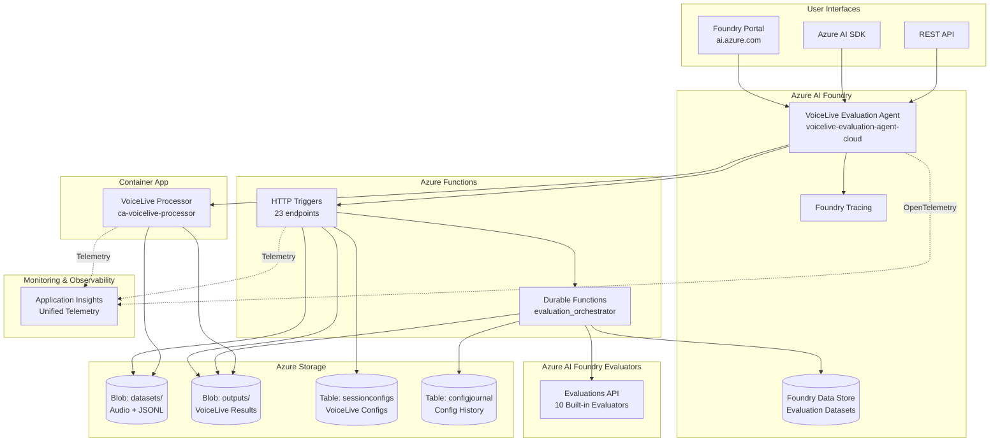
```mermaid
graph TB
    subgraph "User Interfaces"
        FP[Foundry Portal<br/>ai.azure.com]
        SDK[Azure AI SDK]
        API[REST API]
    end
    
    subgraph "Azure AI Foundry"
        Agent[VoiceLive Evaluation Agent<br/>voicelive-evaluation-agent-cloud]
        Trace[Foundry Tracing]
        FDS[(Foundry Data Store<br/>Evaluation Datasets)]
    end
    
    subgraph "Azure Functions"
        HTTP[HTTP Triggers<br/>23 endpoints]
        Durable[Durable Functions<br/>evaluation_orchestrator]
    end
    
    subgraph "Container App"
        VL[VoiceLive Processor<br/>ca-voicelive-processor]
    end
    
    subgraph "Azure Storage"
        DS[(Blob: datasets/<br/>Audio + JSONL)]
        OUT[(Blob: outputs/<br/>VoiceLive Results)]
        TBL1[(Table: sessionconfigs<br/>VoiceLive Configs)]
        TBL2[(Table: configjournal<br/>Config History)]
    end
    
    subgraph "Monitoring & Observability"
        AI[Application Insights<br/>Unified Telemetry]
    end
    
    subgraph "Azure AI Foundry Evaluators"
        EVAL[Evaluations API<br/>10 Built-in Evaluators]
    end
    
    FP --> Agent
    SDK --> Agent
    API --> Agent
    Agent --> HTTP
    Agent --> VL
    Agent --> Trace
    Agent -.->|OpenTelemetry| AI
    HTTP --> Durable
    HTTP --> DS
    HTTP --> OUT
    HTTP --> TBL1
    HTTP -.->|Telemetry| AI
    Durable --> FDS
    Durable --> EVAL
    Durable --> OUT
    Durable --> TBL2
    VL --> DS
    VL --> OUT
    VL -.->|Telemetry| AI
```

## Deployment Architecture

The system is deployed via Azure Developer CLI (azd):

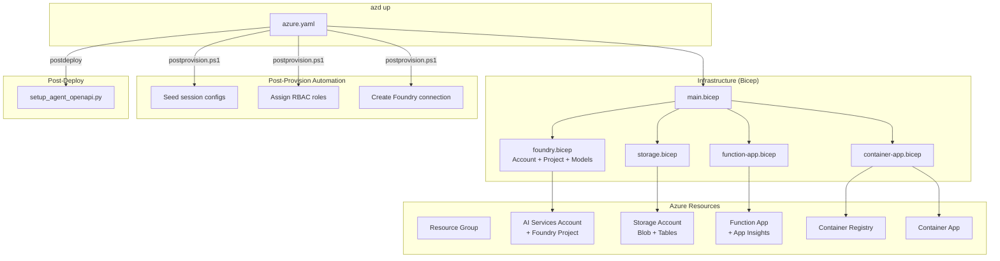
```mermaid
graph TB
    subgraph "azd up"
        AZD[azure.yaml]
    end
    
    subgraph "Infrastructure (Bicep)"
        Main[main.bicep]
        Foundry[foundry.bicep<br/>Account + Project + Models]
        Storage[storage.bicep]
        Func[function-app.bicep]
        CA[container-app.bicep]
    end
    
    subgraph "Azure Resources"
        RG[Resource Group]
        AIF[AI Services Account<br/>+ Foundry Project]
        ST[Storage Account<br/>Blob + Tables]
        FUNC[Function App<br/>+ App Insights]
        ACR[Container Registry]
        CAP[Container App]
    end
    
    subgraph "Post-Provision Automation"
        Seed[Seed session configs]
        RBAC[Assign RBAC roles]
        Conn[Create Foundry connection]
    end
    
    subgraph "Post-Deploy"
        Agent[setup_agent_openapi.py]
    end
    
    AZD --> Main
    Main --> Foundry
    Main --> Storage
    Main --> Func
    Main --> CA
    Foundry --> AIF
    Storage --> ST
    Func --> FUNC
    CA --> ACR
    CA --> CAP
    AZD -->|postprovision.ps1| Seed
    AZD -->|postprovision.ps1| RBAC
    AZD -->|postprovision.ps1| Conn
    AZD -->|postdeploy| Agent
```

### Deployment Modes

The infrastructure supports two deployment modes controlled by the `CREATE_FOUNDRY` parameter:

| Mode | `CREATE_FOUNDRY` | Use Case |
|------|-----------------|----------|
| **Create New** (default) | `true` | Fresh deployment — creates AI Services account, Foundry project, and model deployments |
| **Use Existing** | `false` | Bring your own Foundry project — provide `PROJECT_ENDPOINT` and `AZURE_VOICE_LIVE_ENDPOINT` |

**Create New mode** provisions:
- `Microsoft.CognitiveServices/accounts` (kind: AIServices, `allowProjectManagement: true`)
- `Microsoft.CognitiveServices/accounts/projects` (child resource)
- Model deployments: `gpt-4.1-mini` (GlobalStandard) and `o4-mini` (GlobalStandard)
- Deployments use `@batchSize(1)` to avoid ARM `RequestConflict` errors

**Use Existing mode** requires these azd env vars:
```bash
azd env set CREATE_FOUNDRY false
azd env set PROJECT_ENDPOINT "https://<account>.services.ai.azure.com/api/projects/<project>"
azd env set AZURE_VOICE_LIVE_ENDPOINT "https://<account>.services.ai.azure.com/"
azd env set FOUNDRY_ACCOUNT_RESOURCE_ID "/subscriptions/<sub>/resourceGroups/<rg>/providers/Microsoft.CognitiveServices/accounts/<account>"
```

## Monitoring & Observability

All services share a single **Application Insights** resource for unified operational visibility:

| Service | Telemetry Type | Purpose |
|---------|---------------|---------|
| **Foundry Agent** | OpenTelemetry traces | Agent conversations, tool calls, reasoning |
| **Azure Functions** | Auto-instrumentation | HTTP requests, dependencies, exceptions |
| **Container App** | Custom telemetry | VoiceLive processing metrics, job status |
| **Foundry Tracing** | Built-in | Detailed agent traces in Foundry Portal |

### Application Insights Benefits

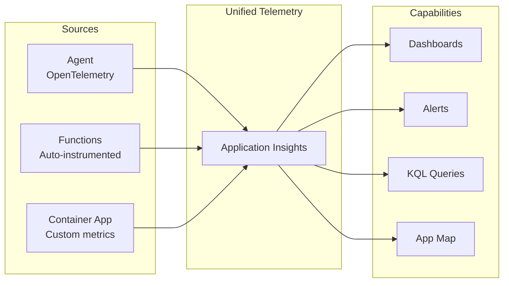
```mermaid
graph LR
    subgraph "Unified Telemetry"
        AI[Application Insights]
    end
    
    subgraph "Sources"
        Agent[Agent<br/>OpenTelemetry]
        Func[Functions<br/>Auto-instrumented]
        CA[Container App<br/>Custom metrics]
    end
    
    subgraph "Capabilities"
        Dash[Dashboards]
        Alert[Alerts]
        Query[KQL Queries]
        Map[App Map]
    end
    
    Agent --> AI
    Func --> AI
    CA --> AI
    AI --> Dash
    AI --> Alert
    AI --> Query
    AI --> Map
```

**Key metrics to track:**
- Agent response latency
- Tool call success/failure rates
- VoiceLive processing duration per file
- Evaluation job completion times
- Error rates by component

### Foundry Tracing vs Application Insights

| Aspect | Foundry Tracing | Application Insights |
|--------|-----------------|----------------------|
| Scope | Agent conversations only | All services |
| Detail | Tool calls, reasoning | Requests, dependencies, exceptions |
| Access | Foundry Portal | Azure Portal |
| Retention | Project-based | Configurable (90 days default) |
| Alerting | Limited | Full Azure Monitor integration |
| Use for | Debugging agent behavior | Operational monitoring |

**Recommendation:** Use both:
- **Foundry Tracing** for debugging agent logic
- **Application Insights** for operational health and cross-service visibility

## Data Storage

Datasets are stored in **two distinct stores** based on type:

| Storage | Content | Purpose |
|---------|---------|---------|
| **Blob: datasets/** | VoiceLive audio datasets (.wav + .jsonl) | Source audio for VoiceLive processing |
| **Foundry Data Store** | Evaluation datasets (query/response JSONL, versioned) | Input to Foundry evaluators |
| **Blob: outputs/** | VoiceLive processing results | Intermediate results (auto-registered to Foundry on completion) |
| **Table: sessionconfigs** | VoiceLive session configurations | Reusable config presets |
| **Table: configjournal** | Session config history | Tracking eval group configurations |

### Dataset Type Architecture

| Aspect | VoiceLive Audio | Evaluation-Ready |
|--------|----------------|-----------------|
| **Store** | Blob `datasets/` | Foundry Data Store |
| **Format** | Zip (.wav + .jsonl) or .jsonl with WavPath | .jsonl with query/response |
| **Required fields** | `WavPath` or `audio` | `query`, `response` |
| **Validation** | `validate_voicelive_dataset` | `validate_eval_dataset` |
| **Upload via** | SAS URL → blob extraction | SAS URL → staging → Foundry upload |
| **Versioning** | Folder-based (manual) | Foundry native (auto-increment on same name) |
| **Discovery** | `list_datasets(type=voicelive)` | `list_datasets(type=evaluation)` |
| **Future** | Migrate to Foundry when audio supported | Already in Foundry |

### Upload Flow (SAS URL Pattern)

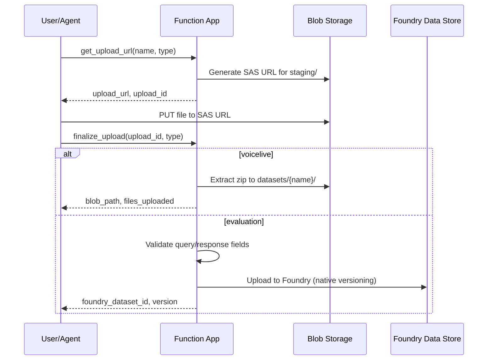
```mermaid
sequenceDiagram
    participant U as User/Agent
    participant F as Function App
    participant B as Blob Storage
    participant FD as Foundry Data Store
    
    U->>F: get_upload_url(name, type)
    F->>B: Generate SAS URL for staging/
    F-->>U: upload_url, upload_id
    U->>B: PUT file to SAS URL
    U->>F: finalize_upload(upload_id, type)
    alt voicelive
        F->>B: Extract zip to datasets/{name}/
        F-->>U: blob_path, files_uploaded
    else evaluation
        F->>F: Validate query/response fields
        F->>FD: Upload to Foundry (native versioning)
        F-->>U: foundry_dataset_id, version
    end
```

### Dataset Lifecycle: VoiceLive Audio → Evaluation

This is the full end-to-end path for VoiceLive audio datasets, showing how data
moves between stores and where Foundry dataset registration happens:

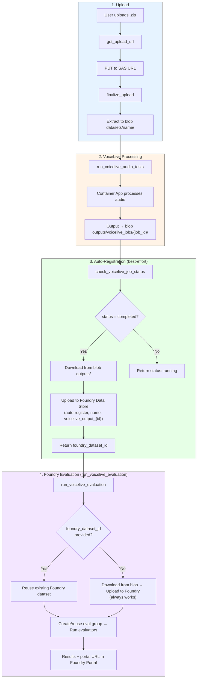
```mermaid
flowchart TD
    subgraph Upload["1. Upload"]
        A[User uploads .zip] --> B[get_upload_url]
        B --> C[PUT to SAS URL]
        C --> D[finalize_upload]
        D --> E[Extract to blob datasets/name/]
    end

    subgraph Process["2. VoiceLive Processing"]
        E --> F[run_voicelive_audio_tests]
        F --> G[Container App processes audio]
        G --> H["Output → blob outputs/voicelive_jobs/{job_id}/"]
    end

    subgraph Register["3. Auto-Registration (best-effort)"]
        H --> I[check_voicelive_job_status]
        I --> J{status = completed?}
        J -- Yes --> K[Download from blob outputs/]
        K --> L["Upload to Foundry Data Store<br/>(auto-register, name: voicelive_output_{id})"]
        L --> M[Return foundry_dataset_id]
        J -- No --> N[Return status: running]
    end

    subgraph Evaluate["4. Foundry Evaluation (run_voicelive_evaluation)"]
        M --> O[run_voicelive_evaluation]
        O --> P{foundry_dataset_id<br/>provided?}
        P -- Yes --> Q[Reuse existing Foundry dataset]
        P -- No --> R["Download from blob → Upload to Foundry<br/>(always works)"]
        Q --> S["Create/reuse eval group → Run evaluators"]
        R --> S
        S --> T["Results + portal URL in Foundry Portal"]
    end

    style Upload fill:#e6f3ff,stroke:#333
    style Process fill:#fff3e6,stroke:#333
    style Register fill:#e6ffe6,stroke:#333
    style Evaluate fill:#f3e6ff,stroke:#333
```

**Key points:**
- Blob `outputs/` is the **source-of-truth** for VoiceLive results (written by Container App)
- Auto-registration (step 3) creates a Foundry copy for discovery and evaluation
- The agent should pass `foundry_dataset_id` from step 3 → step 4 to avoid re-uploading
- If auto-registration fails (non-blocking), the fallback path downloads from blob and uploads fresh

### Dataset Lifecycle: Evaluation-Ready Upload → Evaluation

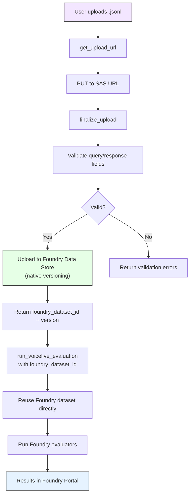
```mermaid
flowchart TD
    A[User uploads .jsonl] --> B[get_upload_url]
    B --> C[PUT to SAS URL]
    C --> D[finalize_upload]
    D --> E[Validate query/response fields]
    E --> F{Valid?}
    F -- Yes --> G["Upload to Foundry Data Store<br/>(native versioning)"]
    G --> H[Return foundry_dataset_id + version]
    F -- No --> I[Return validation errors]

    H --> J[run_voicelive_evaluation<br/>with foundry_dataset_id]
    J --> K[Reuse Foundry dataset directly]
    K --> L[Run Foundry evaluators]
    L --> M[Results in Foundry Portal]

    style A fill:#f3e6ff,stroke:#333
    style G fill:#e6ffe6,stroke:#333
    style M fill:#e6f3ff,stroke:#333
```

### Dataset Lifecycle: Direct Evaluation (Blob Dataset)

For datasets already in blob storage (e.g., uploaded before the new architecture):

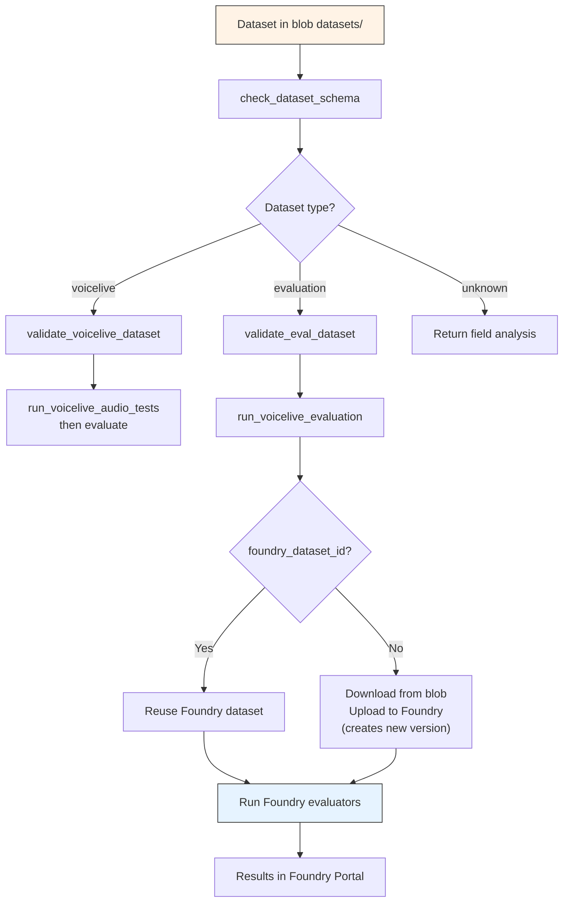
```mermaid
flowchart TD
    A[Dataset in blob datasets/] --> B[check_dataset_schema]
    B --> C{Dataset type?}
    C -- voicelive --> D[validate_voicelive_dataset]
    C -- evaluation --> E[validate_eval_dataset]
    C -- unknown --> F[Return field analysis]

    D --> G[run_voicelive_audio_tests<br/>then evaluate]
    E --> H[run_voicelive_evaluation]
    H --> I{foundry_dataset_id?}
    I -- Yes --> J[Reuse Foundry dataset]
    I -- No --> K["Download from blob<br/>Upload to Foundry<br/>(creates new version)"]
    J --> L[Run Foundry evaluators]
    K --> L
    L --> M[Results in Foundry Portal]

    style A fill:#fff3e6,stroke:#333
    style L fill:#e6f3ff,stroke:#333
```

### Foundry Dataset Upload Points (3 paths)

| # | Trigger | Source | When |
|---|---------|--------|------|
| 1 | `_register_voicelive_output_as_foundry_dataset` | Blob `outputs/` | VoiceLive job completes (auto, non-blocking) |
| 2 | `run_foundry_evaluation` fallback | Blob `datasets/` or `outputs/` | `foundry_dataset_id` not provided (safety net) |
| 3 | `_finalize_eval_upload` | Blob `staging/` | User uploads eval-ready dataset |

All three are intentional — #1 is the happy path, #2 is the fallback, #3 is for new uploads.

### Session Configuration Table

The `sessionconfigs` table stores VoiceLive session presets:

| Field | Type | Description |
|-------|------|-------------|
| PartitionKey | string | Always "voicelive" |
| RowKey | string | Config name (e.g., "default", "conf1") |
| Name | string | Human-readable name |
| Model | string | VoiceLive model (gpt-4.1, gpt-realtime, gpt-realtime-mini) |
| SampleRate | string | Audio sample rate (16000, 24000) |
| VadType | string | VAD type (server_vad, azure_semantic_vad_multilingual) |
| VadThreshold | string | Optional VAD threshold |
| SilenceDurationMs | string | Optional silence duration |
| EouDetection | string | Enable end-of-utterance detection (true/false) |
| EouModel | string | EOU model name |
| TranscriptionModel | string | Transcription model |
| NoiseReduction | string | Noise reduction type |
| EchoCancellation | string | Echo cancellation type |
| VoiceName | string | Voice preset name |
| VoiceType | string | Voice type (preset/custom) |
| IsDefault | string | Is this the default config (true/false) |

### Config Journal Storage Comparison

Considered options for config journal:

| Aspect | Azure Table Storage | Application Insights | CSV on Blob |
|--------|---------------------|----------------------|-------------|
| Purpose | Structured data | Telemetry | Simple files |
| Retention | Permanent | 90 days (configurable) | Permanent |
| Query | OData (simple) | KQL (powerful) | Download + parse |
| Concurrency | Atomic operations | Eventual consistency | Race conditions |
| Best for | **Config journal ✅** | Metrics/alerts | Quick prototypes |

**Decision:** Use **Azure Table Storage** for config journal:
- Permanent retention (configs are reference data)
- Simple entity-based queries
- Atomic insert operations
- Same storage account as blob

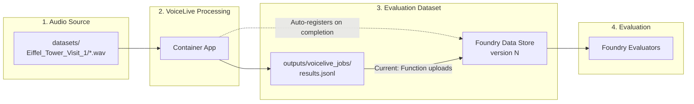
```mermaid
graph LR
    subgraph "1. Audio Source"
        A[datasets/<br/>Eiffel_Tower_Visit_1/*.wav]
    end
    
    subgraph "2. VoiceLive Processing"
        B[Container App]
    end
    
    subgraph "3. Evaluation Dataset"
        C1[outputs/voicelive_jobs/<br/>results.jsonl]
        C2[Foundry Data Store<br/>version N]
    end
    
    subgraph "4. Evaluation"
        D[Foundry Evaluators]
    end
    
    A --> B
    B --> C1
    B -.->|Auto-registers on completion| C2
    C1 -->|Current: Function uploads| C2
    C2 --> D
```

## Service Separation

The system separates concerns across three primary services:

| Service | Purpose | Timeout | Auth |
|---------|---------|---------|------|
| **Container App** | VoiceLive audio processing | Unlimited | Managed Identity |
| **Azure Functions** | Dataset validation, Foundry evaluations | 10 min (Durable) | Function Key |
| **Foundry Agent** | Natural language orchestration | N/A | Foundry Connection |

## VoiceLive Audio Processing

The VoiceLive Container App processes audio files through the VoiceLive SDK in two modes: **VAD mode** (default) uses server-side Voice Activity Detection to auto-detect speech boundaries and trigger responses, while **PTT mode** (`push_to_talk=true`) has the client send audio, commit the buffer, and explicitly call `response.create()`. Both modes support tool calls via the SDK pattern of `FunctionCallOutputItem` with `previous_item_id`, executed after `RESPONSE_DONE`.

### VAD Mode Flow

In VAD mode, audio sending and event collection run concurrently. VAD detects speech boundaries and auto-triggers responses. A silence keepalive loop runs after audio completes to keep the VAD active until the response finishes.

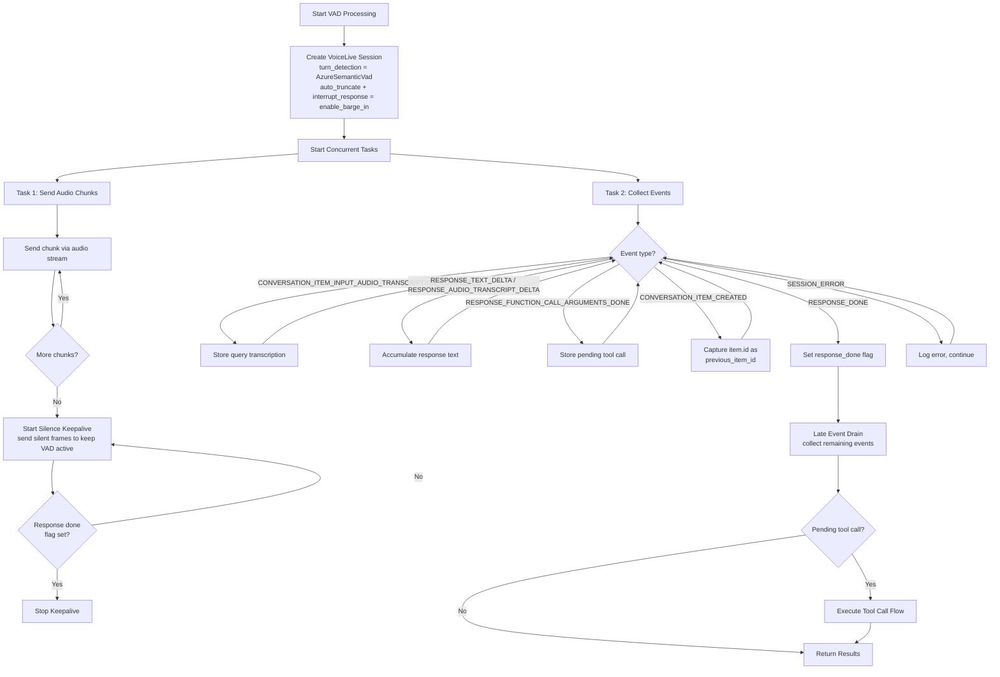
```mermaid
graph TD
    A[Start VAD Processing] --> B[Create VoiceLive Session<br/>turn_detection = AzureSemanticVad<br/>auto_truncate + interrupt_response = enable_barge_in]
    B --> C[Start Concurrent Tasks]
    C --> D[Task 1: Send Audio Chunks]
    C --> E[Task 2: Collect Events]
    D --> D1[Send chunk via audio stream]
    D1 --> D2{More chunks?}
    D2 -->|Yes| D1
    D2 -->|No| D3[Start Silence Keepalive<br/>send silent frames to keep VAD active]
    D3 --> D4{Response done<br/>flag set?}
    D4 -->|No| D3
    D4 -->|Yes| D5[Stop Keepalive]
    E --> E1{Event type?}
    E1 -->|CONVERSATION_ITEM_INPUT_AUDIO_TRANSCRIPTION_COMPLETED| E2[Store query transcription]
    E1 -->|RESPONSE_TEXT_DELTA / RESPONSE_AUDIO_TRANSCRIPT_DELTA| E3[Accumulate response text]
    E1 -->|RESPONSE_FUNCTION_CALL_ARGUMENTS_DONE| E4[Store pending tool call]
    E1 -->|CONVERSATION_ITEM_CREATED| E5[Capture item.id as<br/>previous_item_id]
    E1 -->|RESPONSE_DONE| E6[Set response_done flag]
    E1 -->|SESSION_ERROR| E7[Log error, continue]
    E2 --> E1
    E3 --> E1
    E4 --> E1
    E5 --> E1
    E6 --> E8[Late Event Drain<br/>collect remaining events]
    E7 --> E1
    E8 --> F{Pending tool call?}
    F -->|Yes| G[Execute Tool Call Flow]
    F -->|No| H[Return Results]
    G --> H
```

### PTT Mode Flow

In PTT mode, audio is sent synchronously before event collection begins. After all audio is sent, the client commits the buffer and explicitly requests a response. This sequential pattern prevents the worst race conditions between VAD-triggered and explicitly-requested responses.

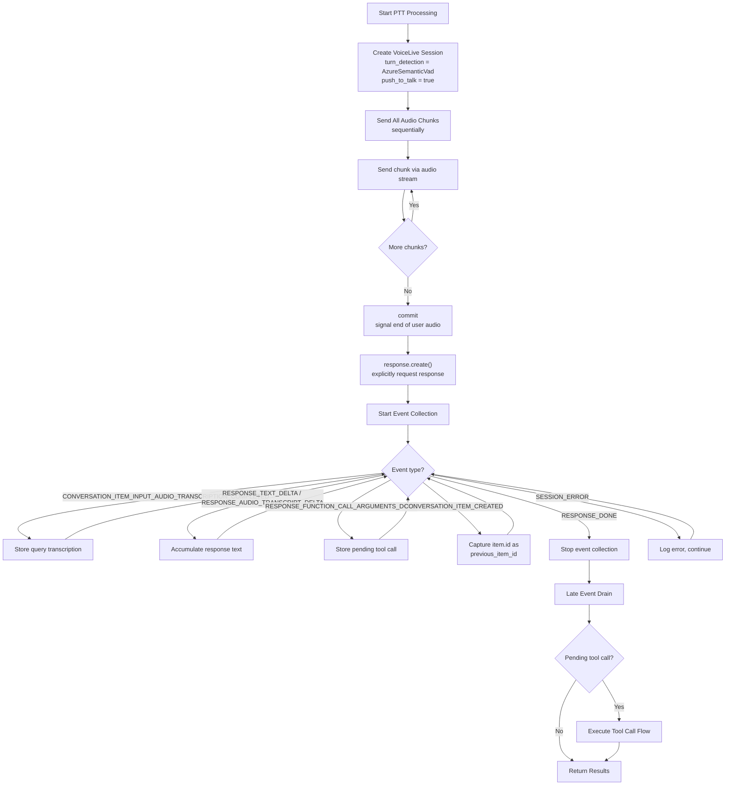
```mermaid
graph TD
    A[Start PTT Processing] --> B[Create VoiceLive Session<br/>turn_detection = AzureSemanticVad<br/>push_to_talk = true]
    B --> C[Send All Audio Chunks<br/>sequentially]
    C --> C1[Send chunk via audio stream]
    C1 --> C2{More chunks?}
    C2 -->|Yes| C1
    C2 -->|No| D[commit<br/>signal end of user audio]
    D --> E["response.create()<br/>explicitly request response"]
    E --> F[Start Event Collection]
    F --> F1{Event type?}
    F1 -->|CONVERSATION_ITEM_INPUT_AUDIO_TRANSCRIPTION_COMPLETED| F2[Store query transcription]
    F1 -->|RESPONSE_TEXT_DELTA / RESPONSE_AUDIO_TRANSCRIPT_DELTA| F3[Accumulate response text]
    F1 -->|RESPONSE_FUNCTION_CALL_ARGUMENTS_DONE| F4[Store pending tool call]
    F1 -->|CONVERSATION_ITEM_CREATED| F5[Capture item.id as<br/>previous_item_id]
    F1 -->|RESPONSE_DONE| F6[Stop event collection]
    F1 -->|SESSION_ERROR| F7[Log error, continue]
    F2 --> F1
    F3 --> F1
    F4 --> F1
    F5 --> F1
    F6 --> F8[Late Event Drain]
    F7 --> F1
    F8 --> G{Pending tool call?}
    G -->|Yes| H[Execute Tool Call Flow]
    G -->|No| I[Return Results]
    H --> I
```

### Tool Call Handling (Both Modes)

Tool calls are executed after `RESPONSE_DONE`, not during the response stream. The SDK pattern uses `FunctionCallOutputItem` with the `previous_item_id` captured from the `CONVERSATION_ITEM_CREATED` event.

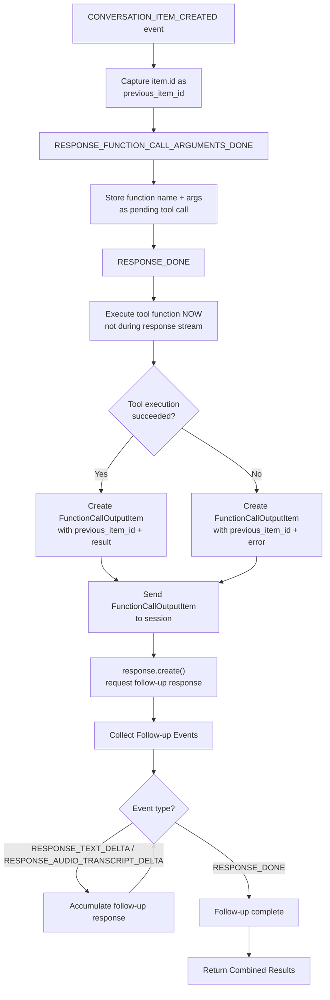
```mermaid
graph TD
    A[CONVERSATION_ITEM_CREATED event] --> A1[Capture item.id as<br/>previous_item_id]
    A1 --> B[RESPONSE_FUNCTION_CALL_ARGUMENTS_DONE]
    B --> B1[Store function name + args<br/>as pending tool call]
    B1 --> C[RESPONSE_DONE]
    C --> C1[Execute tool function NOW<br/>not during response stream]
    C1 --> C2{Tool execution<br/>succeeded?}
    C2 -->|Yes| D[Create FunctionCallOutputItem<br/>with previous_item_id + result]
    C2 -->|No| D1[Create FunctionCallOutputItem<br/>with previous_item_id + error]
    D --> E[Send FunctionCallOutputItem<br/>to session]
    D1 --> E
    E --> F["response.create()<br/>request follow-up response"]
    F --> G[Collect Follow-up Events]
    G --> G1{Event type?}
    G1 -->|RESPONSE_TEXT_DELTA / RESPONSE_AUDIO_TRANSCRIPT_DELTA| G2[Accumulate follow-up response]
    G1 -->|RESPONSE_DONE| G3[Follow-up complete]
    G2 --> G1
    G3 --> H[Return Combined Results]
```

### Evaluation Data Assembly

After audio processing completes for each turn, the system assembles the evaluation output. The key logic determines which text sources populate the `query` and `ground_truth` fields.


```mermaid
flowchart TD
    A[Turn Complete] --> B{JSONL has<br/>Question field?}
    B -->|Yes| C["query user text = Question<br/>(ground-truth from dataset)"]
    B -->|No| D["query user text = VoiceLive transcription<br/>(STT fallback)"]
    C --> E["ground_truth_query_used = true"]
    D --> F["ground_truth_query_used = false"]
    E --> G["transcript = VoiceLive transcription<br/>(always stored for WER evaluation)"]
    F --> G

    G --> H{JSONL has<br/>Answer field?}
    H -->|Yes| I["ground_truth = Answer<br/>(expected response)"]
    H -->|No| J["ground_truth = &#34;&#34;<br/>(no expected response)"]

    I --> K[Build query message list]
    J --> K

    K --> L["system message<br/>(from system_prompt)"]
    L --> M["prior turn messages<br/>(conversation_history)"]
    M --> N["current user message<br/>(query text from above)"]
    N --> O{Turn has<br/>tool calls?}
    O -->|Yes| P["assistant tool_call messages<br/>+ tool result messages<br/>(SDK flat format)"]
    O -->|No| Q[Skip tool messages]
    P --> R[Build response message list]
    Q --> R
    R --> S["response = assistant text<br/>(VoiceLive API response)"]

    style C fill:#e6ffe6,stroke:#333
    style D fill:#fff3e6,stroke:#333
    style I fill:#e6ffe6,stroke:#333
    style J fill:#fff3e6,stroke:#333
```

**Field source summary:**

| Output Field | Primary Source | Fallback | Notes |
|---|---|---|---|
| `query` (user text) | `Question` from JSONL | VoiceLive transcription | `ground_truth_query_used` indicates which |
| `transcript` | VoiceLive transcription | — | Always populated for WER/CER evaluation |
| `response` | VoiceLive API response | — | What the agent actually said |
| `ground_truth` | `Answer` from JSONL | `""` (empty) | Expected response for comparison evaluators |
| `tool_calls` | VoiceLive tool call events | `[]` | SDK flat format with top-level `name`, `arguments` |
| `tool_definitions` | JSONL `tool_definitions` | Session config | Function schemas for tool-calling evaluators |

### Test Results

| Version | PTT Q | PTT R | PTT TC | VAD Q | VAD R | VAD TC | Changes |
|---------|-------|-------|--------|-------|-------|--------|---------|
| Baseline | 5/6 | 2/6 | 0 | 6/6 | 5/6 | 1 | Initial implementation |
| + response.create | 4/6 | 4/6 | 0 | - | - | - | Added response.create after commit |
| + Sequential send | 4/6 | 4/6 | 0 | - | - | - | PTT sends audio before event loop |
| + Tool normalization | 4/6 | 4/6 | 0 | 6/6 | 6/6 | 1 | Fixed tool_definitions dict→list |

### Known Platform Limitation: PTT and turn_detection

The VoiceLive SDK requires `turn_detection` to **always** be set — setting it to `None` breaks sessions entirely (sessions complete in ~6.39s with all empty responses). This means PTT mode cannot use true push-to-talk where VAD is disabled. Instead, PTT uses a **hybrid approach**: VAD is configured via `turn_detection = AzureSemanticVad`, but the client also calls `commit()` + `response.create()` to explicitly request responses.

This hybrid causes **VAD interference** on early turns (turns 2-3 in multi-turn conversations are consistently empty) because VAD-triggered responses race with explicitly-requested responses. The evaluation_harness code never used PTT — it always relied on VAD with silence keepalive.

**No official SDK sample exists** for PTT or pre-recorded audio processing. The `azure-sdk-for-python` samples only demonstrate server VAD with real-time microphone input.

**Feature request**: VoiceLive should support `turn_detection=None` to enable true PTT mode without VAD interference.

### Barge-In / Auto-Truncation

When barge-in is enabled (`enable_barge_in: true`, the default), the VoiceLive session is configured with:

- `auto_truncate=True` on the VAD config — detects when the user speaks during agent audio playback and truncates the agent response in session context
- `interrupt_response=True` — stops the agent from generating further audio output

When a `CONVERSATION_ITEM_TRUNCATED` event fires:
1. `was_truncated` is set to `True` on the turn
2. The full (pre-truncation) response is saved to `response_full`
3. `assistant_response` preserved as-is (truncation reflected in VoiceLive session context)

**Note on `content_index`:** The `CONVERSATION_ITEM_TRUNCATED` event includes a `content_index` field. This is a **content part index** (0, 1, 2...), NOT a character offset. It identifies which content part was truncated, not where in the text the truncation occurred.

### Empty Response Handling

VoiceLive may return no assistant response in two scenarios:
1. **Barge-in truncation before response** — user interrupts before any text is generated
2. **Ambiguous/short input** — VoiceLive cannot generate a meaningful response

Foundry evaluators reject empty response lists (`"Response list cannot be empty"`). Both solutions insert a descriptive placeholder:
```python
# If no response text received:
response_messages = [{"role": "assistant", "content": "[No response — barge-in truncated before response]"}]
# or: "[No response — no response received]"
```

This also applies after tool call flows where the follow-up response may be empty.

In evaluation output, barge-in turns include:
- `barge_in: true` — from the input dataset, marking turns designed to interrupt
- `was_truncated: true` — runtime indicator that truncation actually occurred
- `response_full` — the complete response text before truncation
- `response` — the truncated text (what the user actually heard)

## Design Decisions

### 1. Why Separate Container App for VoiceLive Audio?

**Decision**: Use a dedicated Container App for VoiceLive SDK audio processing, separate from Azure Functions.

**Problem**: VoiceLive audio processing requires:
- Long-running WebSocket connections (minutes per conversation)
- Real-time audio streaming with SDK
- No function timeout constraints

**Alternatives Considered**:
- Azure Functions only (10-min timeout limit)
- Single Container App for everything (over-provisioned for simple tasks)
- Local runner only (not cloud-native)

**Reasoning**:
- **Separation of concerns**: Container App handles long-running audio; Functions handle quick validation
- **Cost efficiency**: Container App scales to zero when idle; Functions are serverless
- **Timeout freedom**: Container App has no execution time limits
- **SDK compatibility**: VoiceLive SDK works best in persistent process

**Architecture**:
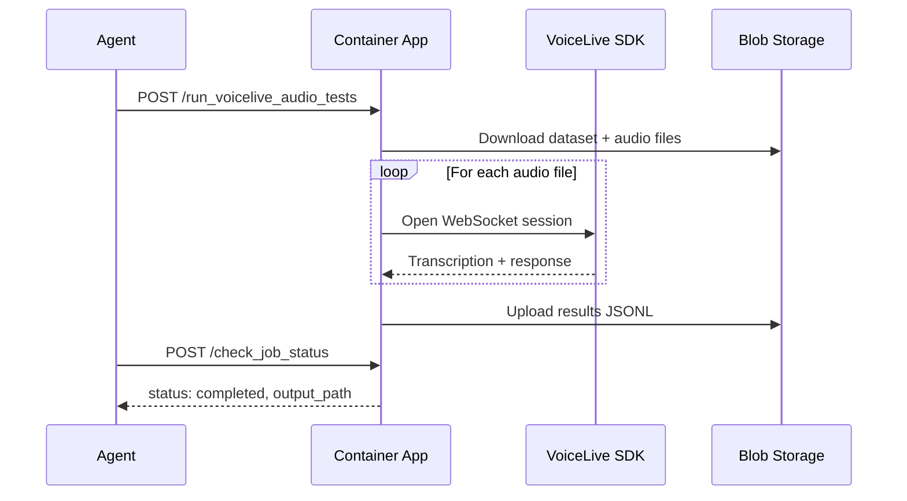
```mermaid
sequenceDiagram
    participant Agent
    participant ContainerApp as Container App
    participant VoiceLive as VoiceLive SDK
    participant Blob as Blob Storage
    
    Agent->>ContainerApp: POST /run_voicelive_audio_tests
    ContainerApp->>Blob: Download dataset + audio files
    loop For each audio file
        ContainerApp->>VoiceLive: Open WebSocket session
        VoiceLive-->>ContainerApp: Transcription + response
    end
    ContainerApp->>Blob: Upload results JSONL
    Agent->>ContainerApp: POST /check_job_status
    ContainerApp-->>Agent: status: completed, output_path
```

---

### 2. Why Azure AI Foundry Agent Service?

**Decision**: Use Foundry Agent Service instead of standalone agent deployment.

**Alternatives Considered**:
- Standalone agent with local runner (v1)
- Container Apps with custom agent loop (v2)
- Foundry Agent Service with OpenAPI tools (v3) ✅

**Reasoning**:
- **Built-in observability**: All conversations and tool calls visible in Foundry Portal tracing
- **Managed infrastructure**: No need to manage agent orchestration
- **Portal integration**: Users can interact via Foundry Portal UI
- **Version management**: Agent versions tracked automatically
- **Simpler deployment**: Agent definition is declarative, tools are HTTP endpoints

**Trade-offs**:
- Less control over agent loop behavior
- Dependent on Foundry service availability
- OpenAPI tool limitations (no streaming, specific auth patterns)

---

### 3. Why Azure Functions + Durable Functions?

**Decision**: Implement validation and evaluation tools as Azure Functions with Durable Functions for long-running evaluations.

**Alternatives Considered**:
- Azure Container Apps (always-on container)
- Standard Functions only (with 10-min timeout)
- All logic in Container App

**Reasoning**:
- **Serverless cost model**: Pay only for execution time
- **Auto-scaling**: Handles variable load automatically
- **Durable Functions**: Orchestrates multi-step evaluation pipeline (download → upload → create eval → return)
- **Non-blocking eval**: `run_foundry_evaluation` returns immediately with eval_id/eval_run_id; `check_evaluation_status` queries Foundry directly

**Durable Functions Flow**:
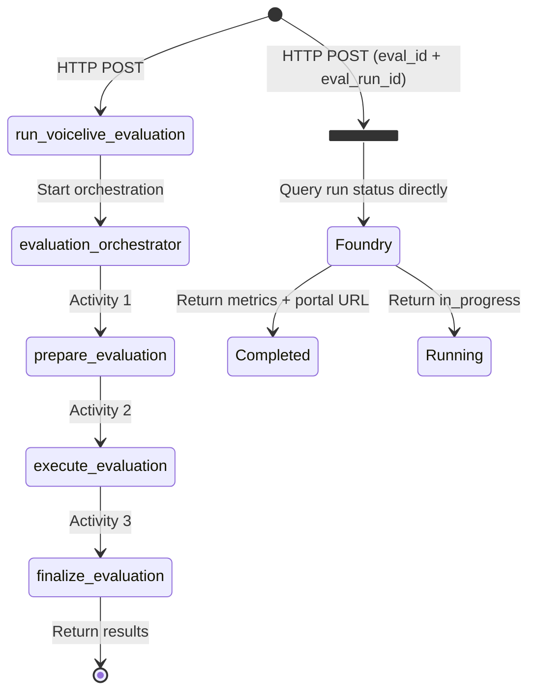
```mermaid
stateDiagram-v2
    [*] --> run_voicelive_evaluation: HTTP POST
    run_voicelive_evaluation --> evaluation_orchestrator: Start orchestration
    evaluation_orchestrator --> prepare_evaluation: Activity 1
    prepare_evaluation --> execute_evaluation: Activity 2
    execute_evaluation --> finalize_evaluation: Activity 3
    finalize_evaluation --> [*]: Return results
    
    state check_status <<fork>>
    [*] --> check_status: HTTP POST (eval_id + eval_run_id)
    check_status --> Foundry: Query run status directly
    Foundry --> Completed: Return metrics + portal URL
    Foundry --> Running: Return in_progress
```

---

### 4. Why Function Keys over Entra ID?

**Decision**: Use Azure Function Keys with Foundry Custom Key Connection.

**Alternatives Considered**:
- Anonymous auth (no security)
- Entra ID Easy Auth (App Registration required)
- Managed Identity with custom token validation
- API Management gateway

**Reasoning**:
- **No App Registration needed**: Enterprise tenants often require ServiceTree GUID for App Registration creation
- **Built-in to Functions**: Function Keys are native, no additional setup
- **Foundry Connection support**: Custom Key Connections work well with OpenAPI tools
- **Simple rotation**: Keys can be rotated in Azure Portal

**Implementation**:
```python
# Function App uses FUNCTION auth level
app = func.FunctionApp(http_auth_level=func.AuthLevel.FUNCTION)

# Agent uses connection-based auth
auth = OpenApiProjectConnectionAuthDetails(
    security_scheme=OpenApiProjectConnectionSecurityScheme(
        project_connection_id="<full-connection-resource-id>"
    )
)
```

---

### 5. Why 8 Default Evaluators?

**Decision**: Focus on agent-specific evaluation criteria for VoiceLive voice agents.

**Default Evaluators**:
| Evaluator | Model Type | Purpose |
|-----------|------------|---------|
| intent_resolution | Reasoning | Did agent understand user intent? |
| task_adherence | Reasoning | Did agent follow instructions? |
| task_completion | Reasoning | Did agent complete the task? |
| response_completeness | Reasoning | Was response complete? |
| tool_call_accuracy | Reasoning | Were tool calls correct? |
| tool_selection | Reasoning | Did agent pick right tools? |
| tool_input_accuracy | Reasoning | Were tool inputs correct? |
| tool_output_utilization | Reasoning | Did agent use tool outputs well? |

**Additional evaluators** (available on request): groundedness, relevance, fluency, coherence.

**Flexibility**: Users can specify custom subset via `evaluators` parameter.

---

### 6. Why Flexible Path Handling?

**Decision**: Make all blob operations accept any path format.

**Problem**: Agent sends paths in various formats:
- `"Eiffel_Tower_Visit_1"` (just name)
- `"Eiffel_Tower_Visit_1/data.jsonl"` (relative)
- `"datasets/Eiffel_Tower_Visit_1/data.jsonl"` (with container)
- `"voicelive_jobs/abc123/results.jsonl"` (outputs container)

**Solution**: Unified path handling with auto-detection:
```python
def download_blob_flexible(container_name, blob_path, extensions, prefer_patterns):
    # 1. Normalize path (strip whitespace, quotes, container prefix)
    # 2. Try exact match first
    # 3. Fall back to fuzzy search with extensions
    # 4. Auto-detect container from path prefix
```

---

### 7. Why Config-Based Eval Group Naming?

**Decision**: Name eval groups based on VoiceLive session configuration, not dataset name.

**Format**: `{model}_{voice}_{vad}_{eod}`
- Example: `gptrealtime_alloy_0.5_500`

**Problem**: With the old naming (`voicelive-eval-{instance_id}`):
- No way to compare runs across same config
- No grouping by agent behavior settings
- No cross-dataset comparison for same agent

**Solution**: Group by config, enabling:
- Cross-dataset comparison within same agent config
- Easy identification of config → eval group mapping
- Config journal in Azure Table Storage for tracking

**Run Naming**: `YYYYMMDD-HHMMSS-xxx │ {dataset}_v{version} │ {evaluator_summary}`
- Timestamp-first for chronological sorting
- 3-char random suffix for parallel jobs
- Dataset version reference for traceability
- Evaluator summary: `all`, `default`, or `subset`

**Example**: `20260206-122000-x7k │ Eiffel_Tower_Visit_1_v1 │ all`

---

### 8. Why Azure Table Storage for Config Journal?

**Decision**: Store config → eval group mappings in Azure Table Storage, not App Insights or CSV.

**Alternatives Considered**:
| Option | Pros | Cons |
|--------|------|------|
| Azure Table Storage ✅ | Permanent, atomic, queryable | Requires SDK |
| App Insights custom events | Unified with telemetry | 90-day retention limit |
| CSV on blob storage | Simple | No atomic writes, corruption risk |

**Table Structure**:
```
Table: configjournal
PartitionKey: "evalgroups"
RowKey: "{eval_group_name}_{timestamp}"
Fields: EvalGroupId, Model, Voice, VadThreshold, EndOfSpeechTimeout, CreatedAt
```

---

## Component Details

### Azure Functions (23 Endpoints)

| Function | Type | Purpose |
|----------|------|---------|
| `list_datasets` | HTTP | List datasets from both stores (voicelive/evaluation/all) |
| `check_dataset_schema` | HTTP | Detect dataset type and list fields |
| `get_upload_url` | HTTP | Generate SAS URL for dataset upload |
| `finalize_upload` | HTTP | Validate and route uploaded dataset to correct store |
| `validate_voicelive_dataset` | HTTP | Validate VoiceLive audio dataset (WavPath required) |
| `validate_eval_dataset` | HTTP | Validate evaluation dataset (query/response required) |
| `validate_dataset_consistency` | HTTP | Backward-compat alias for validate_voicelive_dataset |
| `validate_dataset_quality` | HTTP | Assess content quality (either type) |
| `get_evaluation_recommendations` | HTTP | Suggest settings for large datasets |
| `run_voicelive_evaluation` | HTTP+Durable | Full eval pipeline: download blob results → upload Foundry dataset → create/reuse eval group → run evaluators → return portal URL |
| `check_evaluation_status` | HTTP | Query Foundry eval run status + metrics (accepts eval_id+eval_run_id or instance_id) |
| `analyze_evaluation_results` | HTTP | Analyze completed results |
| `list_evaluation_groups` | HTTP | List Foundry eval groups |
| `list_foundry_datasets` | HTTP | List Foundry datasets |
| `delete_evaluation_groups` | HTTP | Delete eval groups |
| `delete_foundry_datasets` | HTTP | Delete Foundry datasets |
| `evaluation_orchestrator` | Durable | Orchestrate evaluation workflow |
| `prepare_evaluation` | Activity | Prepare output directory |
| `execute_evaluation` | Activity | Run Foundry evaluators |
| `finalize_evaluation` | Activity | Upload results, cleanup |

### Container App Endpoints

| Endpoint | Method | Purpose |
|----------|--------|---------|
| `/run_voicelive_audio_tests` | POST | Start audio processing job |
| `/check_job_status` | POST | Poll job status |
| `/jobs` | GET | List all jobs |
| `/jobs/{job_id}` | GET | Get job details |
| `/health` | GET | Health check |

### Blob Storage Structure

```
st{unique}/
├── datasets/                          # VoiceLive audio datasets
│   ├── Eiffel_Tower_Visit_1/
│   │   ├── Eiffel_Tower_Visit_1.jsonl
│   │   └── *.wav                      # Audio files
│   ├── raw_audio_test.jsonl           # Standalone JSONL
│   └── eval_ready_test.jsonl          # (legacy: eval datasets in blob)
├── outputs/                           # VoiceLive processing results
│   ├── evaluations/                   # Foundry evaluation results
│   │   └── {instance_id}/
│   │       └── results.json
│   └── voicelive_jobs/                # VoiceLive audio results
│       └── {job_id}/
│           ├── metadata.json
│           └── results_YYYYMMDD_HHMMSS.jsonl
└── staging/                           # Temporary upload staging
    └── {upload_id}.{ext}              # Auto-cleaned after finalize
```

**Foundry Data Store** (separate from blob):
```
Foundry Project → Datasets
├── eval_ready_test (v1)               # User-uploaded eval dataset
├── voicelive_output_abc123 (v1)       # Auto-registered from VoiceLive
├── results_20260217_192225 (v1)       # Evaluation results dataset
└── my_custom_eval (v1, v2, v3)        # Versioned on re-upload
```

---

## Security Considerations

### Authentication Flow

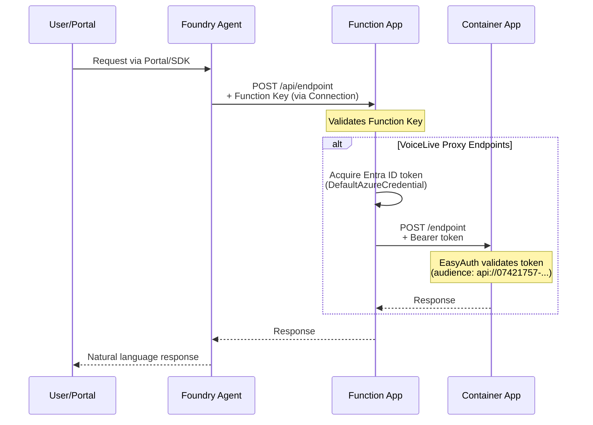
```mermaid
sequenceDiagram
    participant User as User/Portal
    participant Agent as Foundry Agent
    participant Func as Function App
    participant CA as Container App
    
    User->>Agent: Request via Portal/SDK
    Agent->>Func: POST /api/endpoint<br/>+ Function Key (via Connection)
    Note over Func: Validates Function Key
    
    alt VoiceLive Proxy Endpoints
        Func->>Func: Acquire Entra ID token<br/>(DefaultAzureCredential)
        Func->>CA: POST /endpoint<br/>+ Bearer token
        Note over CA: EasyAuth validates token<br/>(audience: api://07421757-...)
        CA-->>Func: Response
    end
    
    Func-->>Agent: Response
    Agent-->>User: Natural language response
```

### Security Layers

1. **Function Keys**: Stored in Foundry Connection, not in code
2. **Container App Entra ID EasyAuth**: Function App MI acquires token for app registration audience; EasyAuth validates before request reaches app code
3. **Blob Storage**: Functions and Container App use managed identity
4. **No secrets in OpenAPI spec**: Auth handled via connection reference
5. **HTTPS only**: All endpoints require HTTPS

### Required RBAC Assignments

| Principal | Role | Scope | Purpose |
|-----------|------|-------|---------|
| Function App MI | Azure AI Developer | Cognitive Services account | Evaluations data plane access |
| Function App MI | Cognitive Services User | Cognitive Services account | General API access |
| Function App MI | Storage Blob Data Contributor | Storage account | Dataset/output read/write |
| Function App MI | ContainerApp.Access (App Role) | App Registration SP | Entra ID auth to Container App |
| Container App MI | Cognitive Services User | Cognitive Services account | VoiceLive SDK access |
| Container App MI | Storage Blob Data Contributor | Storage account | Dataset/output read/write |
| Container App MI | Storage Table Data Contributor | Storage account | Config journal writes |
| Foundry Project MI | Azure AI User | Cognitive Services account | Agent tracing (optional) |

All service RBAC is assigned automatically by `postprovision.ps1` using idempotent check-then-create logic.

---

## Use Case Workflows

### Workflow 1: List and Explore Datasets

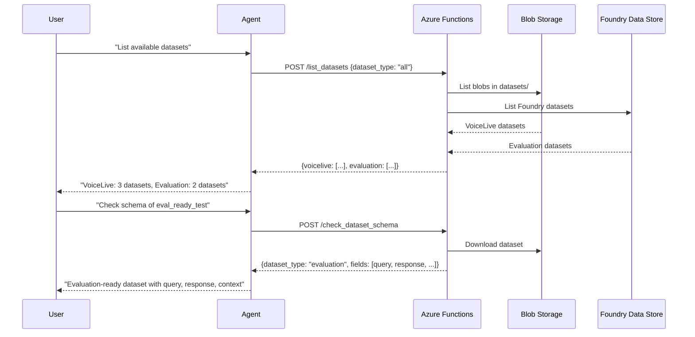
```mermaid
sequenceDiagram
    participant User
    participant Agent
    participant Functions as Azure Functions
    participant Blob as Blob Storage
    participant Foundry as Foundry Data Store
    
    User->>Agent: "List available datasets"
    Agent->>Functions: POST /list_datasets {dataset_type: "all"}
    Functions->>Blob: List blobs in datasets/
    Functions->>Foundry: List Foundry datasets
    Blob-->>Functions: VoiceLive datasets
    Foundry-->>Functions: Evaluation datasets
    Functions-->>Agent: {voicelive: [...], evaluation: [...]}
    Agent-->>User: "VoiceLive: 3 datasets, Evaluation: 2 datasets"
    
    User->>Agent: "Check schema of eval_ready_test"
    Agent->>Functions: POST /check_dataset_schema
    Functions->>Blob: Download dataset
    Functions-->>Agent: {dataset_type: "evaluation", fields: [query, response, ...]}
    Agent-->>User: "Evaluation-ready dataset with query, response, context"
```

### Workflow 2: Validate Dataset Before Evaluation

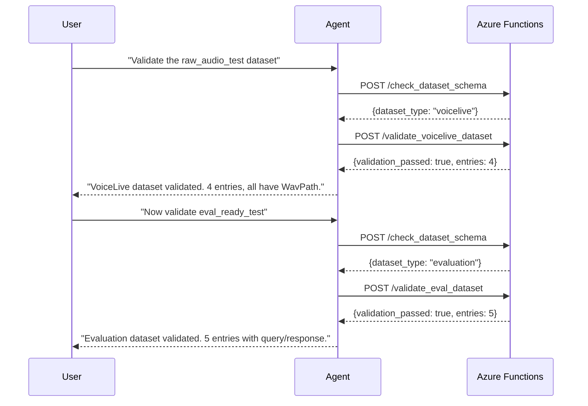
```mermaid
sequenceDiagram
    participant User
    participant Agent
    participant Functions as Azure Functions
    
    User->>Agent: "Validate the raw_audio_test dataset"
    Agent->>Functions: POST /check_dataset_schema
    Functions-->>Agent: {dataset_type: "voicelive"}
    
    Agent->>Functions: POST /validate_voicelive_dataset
    Functions-->>Agent: {validation_passed: true, entries: 4}
    Agent-->>User: "VoiceLive dataset validated. 4 entries, all have WavPath."

    User->>Agent: "Now validate eval_ready_test"
    Agent->>Functions: POST /check_dataset_schema
    Functions-->>Agent: {dataset_type: "evaluation"}
    
    Agent->>Functions: POST /validate_eval_dataset
    Functions-->>Agent: {validation_passed: true, entries: 5}
    Agent-->>User: "Evaluation dataset validated. 5 entries with query/response."
```

### Workflow 3: Run Evaluation on Existing Dataset

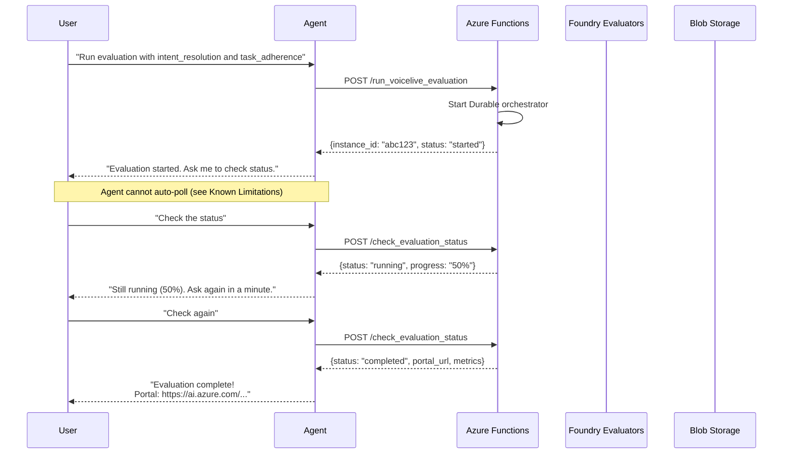
```mermaid
sequenceDiagram
    participant User
    participant Agent
    participant Functions as Azure Functions
    participant Foundry as Foundry Evaluators
    participant Blob as Blob Storage
    
    User->>Agent: "Run evaluation with intent_resolution and task_adherence"
    Agent->>Functions: POST /run_voicelive_evaluation
    Functions->>Functions: Start Durable orchestrator
    Functions-->>Agent: {instance_id: "abc123", status: "started"}
    Agent-->>User: "Evaluation started. Ask me to check status."
    
    Note over User,Agent: Agent cannot auto-poll (see Known Limitations)
    
    User->>Agent: "Check the status"
    Agent->>Functions: POST /check_evaluation_status
    Functions-->>Agent: {status: "running", progress: "50%"}
    Agent-->>User: "Still running (50%). Ask again in a minute."
    
    User->>Agent: "Check again"
    Agent->>Functions: POST /check_evaluation_status
    Functions-->>Agent: {status: "completed", portal_url, metrics}
    Agent-->>User: "Evaluation complete!<br/>Portal: https://ai.azure.com/..."
```

### Workflow 4: Full Audio Processing + Evaluation Pipeline

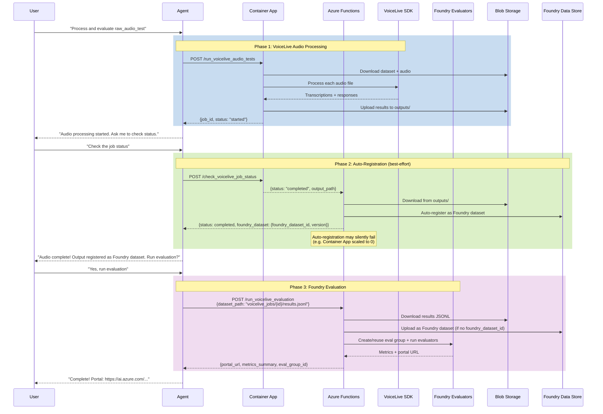
```mermaid
sequenceDiagram
    participant User
    participant Agent
    participant CA as Container App
    participant Functions as Azure Functions
    participant VL as VoiceLive SDK
    participant Foundry as Foundry Evaluators
    participant Blob as Blob Storage
    participant FD as Foundry Data Store
    
    User->>Agent: "Process and evaluate raw_audio_test"
    
    rect rgb(200, 220, 240)
        Note over Agent,VL: Phase 1: VoiceLive Audio Processing
        Agent->>CA: POST /run_voicelive_audio_tests
        CA->>Blob: Download dataset + audio
        CA->>VL: Process each audio file
        VL-->>CA: Transcriptions + responses
        CA->>Blob: Upload results to outputs/
        CA-->>Agent: {job_id, status: "started"}
    end
    
    Agent-->>User: "Audio processing started. Ask me to check status."
    User->>Agent: "Check the job status"
    
    rect rgb(220, 240, 200)
        Note over Agent,FD: Phase 2: Auto-Registration (best-effort)
        Agent->>CA: POST /check_voicelive_job_status
        CA-->>Functions: {status: "completed", output_path}
        Functions->>Blob: Download from outputs/
        Functions->>FD: Auto-register as Foundry dataset
        Functions-->>Agent: {status: completed, foundry_dataset: {foundry_dataset_id, version}}
        Note over Functions: Auto-registration may silently fail<br/>(e.g. Container App scaled to 0)
    end
    
    Agent-->>User: "Audio complete! Output registered as Foundry dataset. Run evaluation?"
    User->>Agent: "Yes, run evaluation"
    
    rect rgb(240, 220, 240)
        Note over Agent,Foundry: Phase 3: Foundry Evaluation
        Agent->>Functions: POST /run_voicelive_evaluation<br/>{dataset_path: "voicelive_jobs/{id}/results.jsonl"}
        Functions->>Blob: Download results JSONL
        Functions->>FD: Upload as Foundry dataset (if no foundry_dataset_id)
        Functions->>Foundry: Create/reuse eval group + run evaluators
        Foundry-->>Functions: Metrics + portal URL
        Functions-->>Agent: {portal_url, metrics_summary, eval_group_id}
    end
    
    Agent-->>User: "Complete! Portal: https://ai.azure.com/..."
```

### Workflow 5: Upload New Dataset

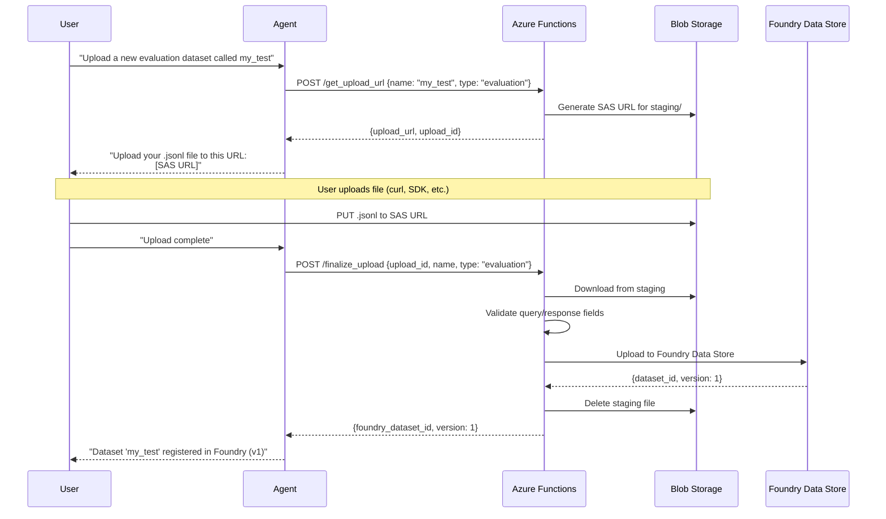
```mermaid
sequenceDiagram
    participant User
    participant Agent
    participant Functions as Azure Functions
    participant Blob as Blob Storage
    participant FD as Foundry Data Store
    
    User->>Agent: "Upload a new evaluation dataset called my_test"
    Agent->>Functions: POST /get_upload_url {name: "my_test", type: "evaluation"}
    Functions->>Blob: Generate SAS URL for staging/
    Functions-->>Agent: {upload_url, upload_id}
    Agent-->>User: "Upload your .jsonl file to this URL:<br/>[SAS URL]"
    
    Note over User,Blob: User uploads file (curl, SDK, etc.)
    User->>Blob: PUT .jsonl to SAS URL
    User->>Agent: "Upload complete"
    
    Agent->>Functions: POST /finalize_upload {upload_id, name, type: "evaluation"}
    Functions->>Blob: Download from staging
    Functions->>Functions: Validate query/response fields
    Functions->>FD: Upload to Foundry Data Store
    FD-->>Functions: {dataset_id, version: 1}
    Functions->>Blob: Delete staging file
    Functions-->>Agent: {foundry_dataset_id, version: 1}
    Agent-->>User: "Dataset 'my_test' registered in Foundry (v1)"
```

### Workflow 6: Manage Foundry Resources

```mermaid
sequenceDiagram
    participant User
    participant Agent
    participant Functions as Azure Functions
    participant Foundry as Foundry Project
    
    User->>Agent: "List my evaluation groups"
    Agent->>Functions: POST /list_evaluation_groups
    Functions->>Foundry: List evals
    Foundry-->>Functions: [51 eval groups]
    Functions-->>Agent: {count: 51, groups: [...]}
    Agent-->>User: "Found 51 evaluation groups..."
    
    User->>Agent: "Delete all groups containing 'test'"
    Agent->>Functions: POST /delete_evaluation_groups<br/>{search_string: "test"}
    Functions->>Foundry: Delete matching
    Foundry-->>Functions: Deleted 5
    Functions-->>Agent: {deleted_count: 5}
    Agent-->>User: "Deleted 5 evaluation groups"
```

### Workflow 6: Reuse Existing Foundry Resources

```mermaid
sequenceDiagram
    participant User
    participant Agent
    participant Functions as Azure Functions
    participant Foundry as Foundry Project
    
    User->>Agent: "List datasets and use existing one"
    Agent->>Functions: POST /list_foundry_datasets
    Functions-->>Agent: {datasets: [{id, name}, ...]}
    Agent-->>User: "Found 60 datasets. Which one?"
    
    User->>Agent: "Use dataset eval-dataset-771f3d39"
    Agent->>Functions: POST /run_voicelive_evaluation<br/>{foundry_dataset_id: "azureai://..."}
    
    Note over Functions,Foundry: Skip upload, reuse existing
    Functions->>Foundry: Create eval run with existing dataset
    Foundry-->>Functions: Results
    Functions-->>Agent: {portal_url, metrics}
    Agent-->>User: "Evaluation complete (reused existing dataset)"
```

---

## Deployed Resources

| Resource | Name | Purpose |
|----------|------|---------|
| Resource Group | rg-voicelive-eval-v3 | Container for all resources |
| Storage Account | stv3g7ywvldzjeo | datasets/ and outputs/ containers |
| Function App | func-v3g7ywvldzjeo | 14 functions (HTTP + Durable) |
| Container App | ca-voicelive-processor | VoiceLive audio processing |
| Container Registry | acrvoicelive9976 | Container images |
| App Insights | func-v3g7ywvldzjeo-insights | Monitoring |
| **Agent** | voicelive-evaluation-agent-cloud | Foundry Agent |
| **Connection** | voicelive-eval-api-key | Function Key auth |

---

## Open Work Items

### ~~High Priority: Dataset Versioning & Eval Group Strategy~~ ✅ Implemented

**Goal**: Implement proper versioning and organization for datasets and evaluation groups.

#### ~~Phase 1: Versioning in Function App~~ ✅ Complete
- [x] **Version datasets on upload** — `run_foundry_evaluation` checks existing versions via `datasets.list()`, increments version number (line ~2124). `_finalize_eval_upload` uses Foundry native versioning on same-name upload.
- [x] **One eval group per dataset** — `eval_group_id` parameter allows reusing existing eval groups (line ~2094). Config-based naming via `generate_eval_group_name()` groups runs by config. Agent instructions say to pass `foundry_dataset_id` from auto-register to avoid re-upload.
- [x] **Track lineage metadata** — `_register_voicelive_output_as_foundry_dataset` sets `description=f"VoiceLive processing output (job: {job_id})"`. Run metadata includes `instance_id`, `source`, `dataset_version`, `evaluators`. Config journal tracks eval group → session config mapping.
- [x] **Return version info** — `run_foundry_evaluation` returns `dataset_id`, `dataset_version`, `eval_group_id`, `eval_run_id`, `portal_url`. Auto-register returns `foundry_dataset_id`, `name`, `version`. Upload finalize returns `foundry_dataset_id`, `version`.

#### ~~Phase 2: Move Upload to Container App~~ ✅ Partially Achieved
Auto-registration in `check_voicelive_job_status` attempts Foundry dataset upload on job completion via `_register_voicelive_output_as_foundry_dataset()`. However, this is **best-effort** — it silently fails if the Container App has scaled to zero before status is checked. The `run_voicelive_evaluation` pipeline handles its own Foundry dataset upload as the reliable path.

### Other High Priority
- [x] **Add RBAC assignments to azd automation** - Post-provision hook assigns Azure AI Developer + Cognitive Services User roles
- [x] **Fix VoiceLive Container App progress tracking** - Per-file progress updates via callback in process_conversation
- [x] **Add Foundry connection creation to azd** - Post-provision hook creates CustomKeys connection via ARM
- [ ] **Add webhook notifications** - Notify when long evaluations complete
- [x] ~~**BUG: Eval group reuse requires ID not name**~~ ✅ Fixed — `run_foundry_evaluation` now looks up existing eval groups by config-based name before creating. If a name match is found, its ID is reused automatically. Explicit `eval_group_id` parameter still works for direct ID reuse.

### Feature Backlog
- [x] **VAD Default End Detection** ✅ — VoiceLive processor default uses VAD (server-side Voice Activity Detection) to detect end of audio input. No explicit `audio_input_finished` event is sent. VAD mode achieves 6/6 queries, 6/6 responses, 1/1 tool calls.
- [x] **Push-to-Talk Flag** ✅ — `push_to_talk=true` in session config enables PTT mode with `commit()` + `response.create()`. Achieves 4/6 responses due to VAD interference (platform limitation — `turn_detection=None` not supported). See "VoiceLive Audio Processing" section for details.
- [ ] **Blob Output Cleanup** — Endpoint to delete old VoiceLive output blobs from the `outputs` container (Foundry dataset and eval group deletion already implemented)

### Medium Priority
- [x] **Add Foundry account/project creation to azd** - Creates AI Services account, Foundry project, and model deployments via Bicep
  - `foundry.bicep` module with `@batchSize(1)` deployments
  - `createFoundry` parameter (default: true) with existing-project fallback
  - Resolved variables pattern for endpoint auto-detection
  - All RBAC in `postprovision.ps1` for ARM idempotency
- [ ] **Private VNet architecture** - Move all backend services to private endpoints
  - Deploy Container App with internal-only ingress
  - Add VNet integration to Function App
  - Remove public endpoints for Container App
  - Function App → Container App communication over private network
- [ ] **Multi-region deployment** - Deploy Functions/Container App closer to data
- [ ] **Add retry logic** - Handle transient failures in VoiceLive SDK
- [ ] **Implement rate limiting** - Prevent quota exhaustion on Foundry evaluators

### Low Priority
- [ ] **Progress streaming** - Report evaluation progress in real-time via SSE
- [ ] **Cost optimization** - Use Premium Functions plan for faster cold starts
- [ ] **Container App scaling** - Auto-scale based on queue depth

### Known Limitations
1. **No autonomous polling** - The Foundry Agent Service (Responses API) can call multiple tools within a single turn, but **cannot autonomously initiate new turns or wait between tool calls**. When the agent says "I'll keep checking the status", it actually ends the turn and waits for the user to ask again. The 10-minute run timeout also prevents long polling loops within a turn. **Workaround**: Agent instructions now tell the user to ask for status updates manually. Future improvement: add webhook/callback notifications for long-running jobs.
2. **Metrics sometimes empty** - Foundry SDK may not return metrics immediately after run completion. No retry/backoff on metrics retrieval yet.
3. **Container App auth** - Uses Entra ID EasyAuth with app registration `voicelive-container-app-auth` (07421757-...). This is operational, not a bug.
4. **eval_group_id reuse** - Only works within same Foundry project. This is a design constraint, not a bug.
5. **Evaluation datasets use Foundry native versioning** - Same name creates new version automatically. This is by design.
6. **azd Container App push** - `azd deploy` may get stuck pushing Container App image to ACR; workaround: `docker build` → `docker push` → `az containerapp update` manually
7. **Cognitive Services soft-delete** - Deleting an AI Services account soft-deletes it; recreating with same name requires `az cognitiveservices account purge` first
8. **ARM role assignment idempotency** - `Microsoft.Authorization/roleAssignments` in Bicep can throw `RoleAssignmentExists` on re-provision; all service RBAC is done via PowerShell scripts instead
9. ~~**Foundry dataset URI in validate_eval_dataset**~~ — ✅ Fixed. Both `validate_eval_dataset` and `check_dataset_schema` now resolve Foundry URIs (`azureai://...`), plain Foundry dataset names, and blob paths.
10. ~~**BUG: Eval group comparison runs create separate groups**~~ — ✅ Fixed. `execute_evaluation` now surfaces `eval_id`/`eval_run_id` at top level. `check_evaluation_status` returns `eval_group_id` field. Agent instructions document the chaining workflow: first run → check status → get `eval_group_id` → pass to second run.
11. **Auto-registration is best-effort** - `check_voicelive_job_status` attempts to register VoiceLive output as a Foundry dataset, but silently fails if the Container App has scaled to zero before status is polled. The `run_voicelive_evaluation` pipeline handles its own upload as the reliable path.
12. **PTT mode limited by race condition** — VoiceLive requires `turn_detection` to always be configured. PTT mode (`push_to_talk=true`) uses VAD + `commit()` + `response.create()` hybrid, achieving ~50-60% response rate vs VAD's ~90-100%. The `conversation_already_has_active_response` error occurs when committing audio triggers a response before the commit event fully processes. Feature request filed for `turn_detection=None` support.
13. **Tool definitions normalization** — Dataset JSONL may contain `tool_definitions` as a single dict instead of a list. The processor normalizes this automatically, but datasets should ideally use array format: `"tool_definitions": [{"type":"function",...}]`
14. **Foundry Agent UX does not support .jsonl file uploads** — The Foundry NEXTGEN Agent portal chat UI only accepts a limited set of file types (.json, .txt, .pdf, etc.) for attachment. `.jsonl` is **not** in the supported list. Users cannot drag-and-drop JSONL files into the agent conversation. **Workaround**: Use the SAS URL upload pattern (get_upload_url → finalize_upload) or upload datasets via the SDK/API. A custom web frontend is planned to remove this limitation.
15. **Eval group reuse with stale evaluators** — When `run_foundry_evaluation` creates an eval group by name, it reuses existing groups with the same name. If an earlier run created the group with different evaluators (e.g. fluency-only for testing), subsequent runs inherit those evaluators instead of the defaults. **Workaround**: Delete stale eval groups before running with different evaluator sets, or pass explicit `eval_group_id=None` to force a new group.
16. ~~**Empty response causes FAILED_EXECUTION**~~ — ✅ Fixed. Foundry rejects empty response lists. Both solutions now insert a descriptive placeholder when VoiceLive returns no response (barge-in or ambiguous input).
17. ~~**content_index misused as string offset**~~ — ✅ Fixed. The `CONVERSATION_ITEM_TRUNCATED` event's `content_index` is a content part index, not a character offset. Removed incorrect string slicing.
18. ~~**Batch processor race condition**~~ — ✅ Fixed. Per-process output files with post-aggregation instead of concurrent writes to a shared file.

### Future Improvements
1. **Managed Identity auth for Foundry → Function App** - Code path exists (`--entra-auth --client-id` in `setup_agent_openapi.py` using `OpenApiManagedAuthDetails`), but deployment currently uses connection-based API key auth via `postdeploy.ps1`. Activating requires: create a separate app registration for the Function App, enable EasyAuth on Function App, update postdeploy to use `--entra-auth` instead of `--connection-name`.
2. **Private VNet architecture** - All backend services (Functions, Container App, Storage) on private endpoints for enhanced security
3. ~~**VAD-based end detection**~~ ✅ Implemented - Default behavior now uses VAD (no explicit `audio_input_finished`). `push_to_talk` flag enables explicit commit for comparison testing.

### SDK Limitations (Confirmed via Source Review)

The `azure-ai-projects` SDK has the following limitations that require manual configuration:

| Operation | SDK Support | Alternative |
|-----------|-------------|-------------|
| Create Foundry connections | ❌ No | Portal, CLI, Terraform (azapi_resource), ARM |
| Update connection credentials | ❌ No | Portal manual edit |
| Configure agent App Insights | ❌ No | Portal → Tracing → Connect App Insights |
| Delete connections | ❌ No | Portal, Terraform, ARM |

**Connections SDK**: `ConnectionsOperations` only supports `list`, `get`, `get_default` - no create/update/delete methods.

**Workaround for Terraform/IaC**:
```hcl
resource "azapi_resource" "voicelive_connection" {
  type      = "Microsoft.MachineLearningServices/workspaces/connections@2025-01-01-preview"
  name      = "voicelive-eval-api-key"
  parent_id = azurerm_ai_foundry_project.example.id
  body = {
    properties = {
      category = "ApiKey"
      target   = var.function_app_url
      authType = "CustomKeys"
      credentials = { key = var.function_key }
    }
  }
}
```

**Client-side tracing** (calling the agent from your code) is fully supported via `azure-monitor-opentelemetry`:
```python
from azure.monitor.opentelemetry import configure_azure_monitor
configure_azure_monitor(connection_string="InstrumentationKey=...")
```

---

## Version Comparison

| Aspect | v1 | v2 | v3 |
|--------|----|----|-----|
| SDK | azure-ai-agents | azure-ai-agents | **azure-ai-projects** |
| Deployment | Local only | Container Apps | Foundry + Functions + Container App |
| Agent lifecycle | Per-session | Per-session | **Persistent** |
| Audio processing | Local script | Local script | **Cloud Container App** |
| Foundry evaluation | None | None | **10 built-in evaluators** |
| Tracing | Console | AppInsights | **Foundry native** |
| Portal | None | Azure Portal | **AI Foundry Portal** |

---

### SDK Version Requirements

| Package | Min Version | Notes |
|---------|-------------|-------|
| `azure-ai-evaluation` | 1.15.3 | Stable release — Foundry evaluators, tool message validation |
| `azure-ai-projects` | 2.0.0b4 | Foundry project client, dataset management |
| `azure-ai-agents` | 1.2.0b6 | Agent models (`FunctionTool`, `OpenApiTool`, etc.) |
| `azure-ai-voicelive` | 1.2.0b4 | VoiceLive S2ST SDK (pre-release) |

### Tool Message Format (SDK Canonical)

The azure-ai-evaluation SDK expects tool-calling messages in a **flat format** (not the nested OpenAI wire format). This is enforced by Foundry UX server-side validation before dispatching to any evaluator.

**Assistant tool-call content items:**
```json
{"type": "tool_call", "tool_call_id": "call_xxx", "name": "get_weather", "arguments": {"location": "Seattle"}}
```

**Tool result content items:**
```json
{"type": "tool_result", "tool_result": "{\"temperature\": 72}"}
```

Key differences from OpenAI wire format:
- `name` and `tool_call_id` are at the **top level** (not nested under `tool_call.function`)
- `arguments` is a **parsed dict** (not a JSON string)
- No nested `tool_call` sub-object

*Document last updated: March 6, 2026*
