# VoiceLive Evaluation Agent v3 - Architecture

*Last updated: February 7, 2026*

## Overview

The VoiceLive Evaluation Agent v3 is a cloud-native AI agent deployed on Azure AI Foundry Agent Service. It automates the validation and execution of VoiceLive audio evaluation workflows through natural language interaction.

## System Architecture

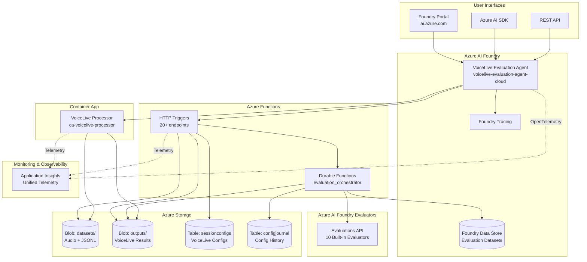

## Deployment Architecture

The system is deployed via Azure Developer CLI (azd):

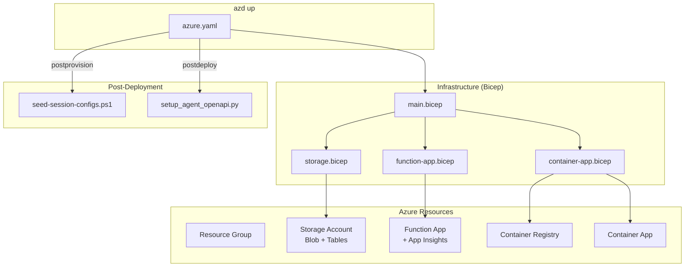

## Monitoring & Observability

All services share a single **Application Insights** resource for unified operational visibility:

| Service | Telemetry Type | Purpose |
|---------|---------------|---------|
| **Foundry Agent** | OpenTelemetry traces | Agent conversations, tool calls, reasoning |
| **Azure Functions** | Auto-instrumentation | HTTP requests, dependencies, exceptions |
| **Container App** | Custom telemetry | VoiceLive processing metrics, job status |
| **Foundry Tracing** | Built-in | Detailed agent traces in Foundry Portal |

### Application Insights Benefits

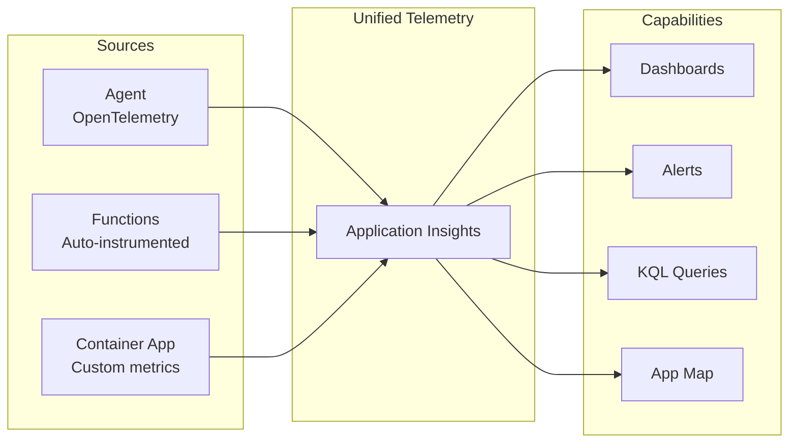

**Key metrics to track:**
- Agent response latency
- Tool call success/failure rates
- VoiceLive processing duration per file
- Evaluation job completion times
- Error rates by component

### Foundry Tracing vs Application Insights

| Aspect | Foundry Tracing | Application Insights |
|--------|-----------------|----------------------|
| Scope | Agent conversations only | All services |
| Detail | Tool calls, reasoning | Requests, dependencies, exceptions |
| Access | Foundry Portal | Azure Portal |
| Retention | Project-based | Configurable (90 days default) |
| Alerting | Limited | Full Azure Monitor integration |
| Use for | Debugging agent behavior | Operational monitoring |

**Recommendation:** Use both:
- **Foundry Tracing** for debugging agent logic
- **Application Insights** for operational health and cross-service visibility

## Data Storage

Datasets are stored in **multiple locations** with different purposes:

| Storage | Content | Purpose |
|---------|---------|---------|
| **Blob: datasets/** | VoiceLive audio datasets (.wav + .jsonl) | Source audio for processing |
| **Blob: outputs/** | VoiceLive processing results | Backup + debugging |
| **Foundry Data Store** | Evaluation datasets (versioned) | Input to Foundry evaluators |
| **Table: sessionconfigs** | VoiceLive session configurations | Reusable config presets |
| **Table: configjournal** | Session config history | Tracking eval group configurations |

### Session Configuration Table

The `sessionconfigs` table stores VoiceLive session presets:

| Field | Type | Description |
|-------|------|-------------|
| PartitionKey | string | Always "voicelive" |
| RowKey | string | Config name (e.g., "default", "conf1") |
| Name | string | Human-readable name |
| Model | string | VoiceLive model (gpt-4.1, gpt-realtime, gpt-realtime-mini) |
| SampleRate | string | Audio sample rate (16000, 24000) |
| VadType | string | VAD type (server_vad, azure_semantic_vad_multilingual) |
| VadThreshold | string | Optional VAD threshold |
| SilenceDurationMs | string | Optional silence duration |
| EouDetection | string | Enable end-of-utterance detection (true/false) |
| EouModel | string | EOU model name |
| TranscriptionModel | string | Transcription model |
| NoiseReduction | string | Noise reduction type |
| EchoCancellation | string | Echo cancellation type |
| VoiceName | string | Voice preset name |
| VoiceType | string | Voice type (preset/custom) |
| IsDefault | string | Is this the default config (true/false) |

### Config Journal Storage Comparison

Considered options for config journal:

| Aspect | Azure Table Storage | Application Insights | CSV on Blob |
|--------|---------------------|----------------------|-------------|
| Purpose | Structured data | Telemetry | Simple files |
| Retention | Permanent | 90 days (configurable) | Permanent |
| Query | OData (simple) | KQL (powerful) | Download + parse |
| Concurrency | Atomic operations | Eventual consistency | Race conditions |
| Best for | **Config journal ✅** | Metrics/alerts | Quick prototypes |

**Decision:** Use **Azure Table Storage** for config journal:
- Permanent retention (configs are reference data)
- Simple entity-based queries
- Atomic insert operations
- Same storage account as blob

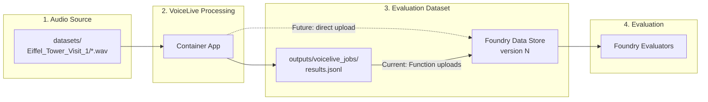

## Service Separation

The system separates concerns across three primary services:

| Service | Purpose | Timeout | Auth |
|---------|---------|---------|------|
| **Container App** | VoiceLive audio processing | Unlimited | Managed Identity |
| **Azure Functions** | Dataset validation, Foundry evaluations | 10 min (Durable) | Function Key |
| **Foundry Agent** | Natural language orchestration | N/A | Foundry Connection |

## Design Decisions

### 1. Why Separate Container App for VoiceLive Audio?

**Decision**: Use a dedicated Container App for VoiceLive SDK audio processing, separate from Azure Functions.

**Problem**: VoiceLive audio processing requires:
- Long-running WebSocket connections (minutes per conversation)
- Real-time audio streaming with SDK
- No function timeout constraints

**Alternatives Considered**:
- Azure Functions only (10-min timeout limit)
- Single Container App for everything (over-provisioned for simple tasks)
- Local runner only (not cloud-native)

**Reasoning**:
- **Separation of concerns**: Container App handles long-running audio; Functions handle quick validation
- **Cost efficiency**: Container App scales to zero when idle; Functions are serverless
- **Timeout freedom**: Container App has no execution time limits
- **SDK compatibility**: VoiceLive SDK works best in persistent process

**Architecture**:
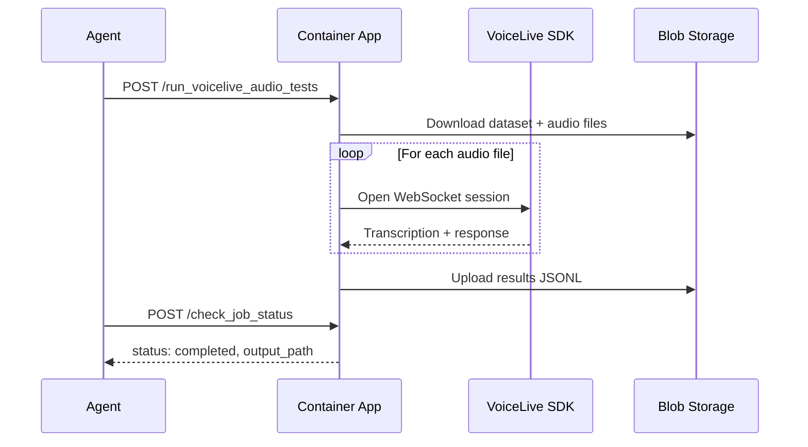

---

### 2. Why Azure AI Foundry Agent Service?

**Decision**: Use Foundry Agent Service instead of standalone agent deployment.

**Alternatives Considered**:
- Standalone agent with local runner (v1)
- Container Apps with custom agent loop (v2)
- Foundry Agent Service with OpenAPI tools (v3) ✅

**Reasoning**:
- **Built-in observability**: All conversations and tool calls visible in Foundry Portal tracing
- **Managed infrastructure**: No need to manage agent orchestration
- **Portal integration**: Users can interact via Foundry Portal UI
- **Version management**: Agent versions tracked automatically
- **Simpler deployment**: Agent definition is declarative, tools are HTTP endpoints

**Trade-offs**:
- Less control over agent loop behavior
- Dependent on Foundry service availability
- OpenAPI tool limitations (no streaming, specific auth patterns)

---

### 3. Why Azure Functions + Durable Functions?

**Decision**: Implement validation and evaluation tools as Azure Functions with Durable Functions for long-running evaluations.

**Alternatives Considered**:
- Azure Container Apps (always-on container)
- Standard Functions only (with 10-min timeout)
- All logic in Container App

**Reasoning**:
- **Serverless cost model**: Pay only for execution time
- **Auto-scaling**: Handles variable load automatically
- **Durable Functions**: Overcomes 10-minute timeout for Foundry evaluations
- **Async pattern**: Natural fit for AI agent workflows (start job → poll status)

**Durable Functions Flow**:
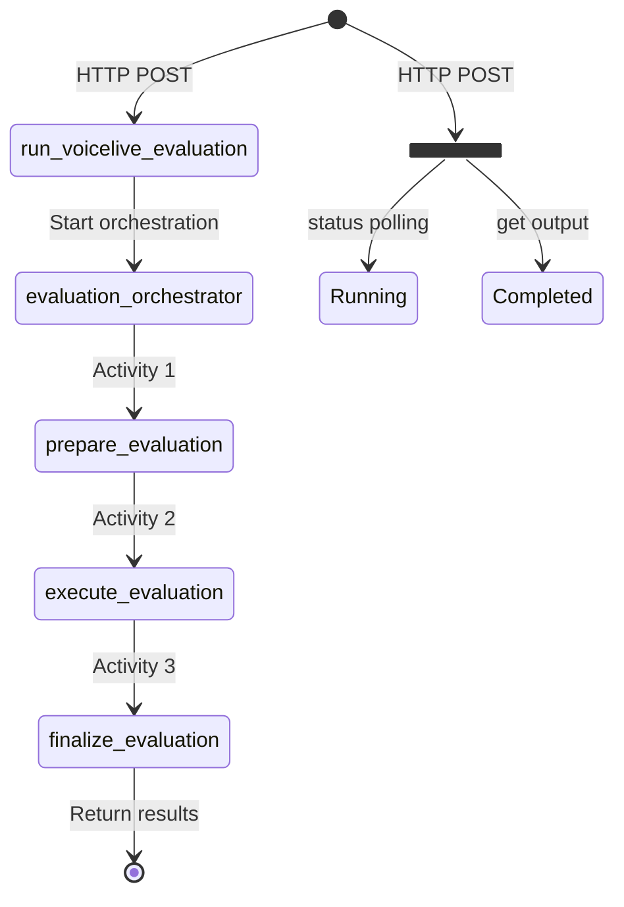

---

### 4. Why Function Keys over Entra ID?

**Decision**: Use Azure Function Keys with Foundry Custom Key Connection.

**Alternatives Considered**:
- Anonymous auth (no security)
- Entra ID Easy Auth (App Registration required)
- Managed Identity with custom token validation
- API Management gateway

**Reasoning**:
- **No App Registration needed**: Enterprise tenants often require ServiceTree GUID for App Registration creation
- **Built-in to Functions**: Function Keys are native, no additional setup
- **Foundry Connection support**: Custom Key Connections work well with OpenAPI tools
- **Simple rotation**: Keys can be rotated in Azure Portal

**Implementation**:
```python
# Function App uses FUNCTION auth level
app = func.FunctionApp(http_auth_level=func.AuthLevel.FUNCTION)

# Agent uses connection-based auth
auth = OpenApiProjectConnectionAuthDetails(
    security_scheme=OpenApiProjectConnectionSecurityScheme(
        project_connection_id="<full-connection-resource-id>"
    )
)
```

---

### 5. Why 10 Default Evaluators?

**Decision**: Align with prototype_v1's evaluator set for consistency.

**Default Evaluators**:
| Evaluator | Model Type | Purpose |
|-----------|------------|---------|
| intent_resolution | Reasoning | Did agent understand user intent? |
| task_adherence | Reasoning | Did agent follow instructions? |
| task_completion | Reasoning | Did agent complete the task? |
| response_completeness | Reasoning | Was response complete? |
| groundedness | Standard | Is response grounded in context? |
| relevance | Reasoning | Is response relevant to query? |
| tool_call_accuracy | Reasoning | Were tool calls correct? |
| tool_selection | Reasoning | Did agent pick right tools? |
| tool_input_accuracy | Reasoning | Were tool inputs correct? |
| tool_output_utilization | Reasoning | Did agent use tool outputs well? |

**Flexibility**: Users can specify custom subset via `evaluators` parameter.

---

### 6. Why Flexible Path Handling?

**Decision**: Make all blob operations accept any path format.

**Problem**: Agent sends paths in various formats:
- `"Eiffel_Tower_Visit_1"` (just name)
- `"Eiffel_Tower_Visit_1/data.jsonl"` (relative)
- `"datasets/Eiffel_Tower_Visit_1/data.jsonl"` (with container)
- `"voicelive_jobs/abc123/results.jsonl"` (outputs container)

**Solution**: Unified path handling with auto-detection:
```python
def download_blob_flexible(container_name, blob_path, extensions, prefer_patterns):
    # 1. Normalize path (strip whitespace, quotes, container prefix)
    # 2. Try exact match first
    # 3. Fall back to fuzzy search with extensions
    # 4. Auto-detect container from path prefix
```

---

### 7. Why Config-Based Eval Group Naming?

**Decision**: Name eval groups based on VoiceLive session configuration, not dataset name.

**Format**: `{model}_{voice}_{vad}_{eod}`
- Example: `gptrealtime_alloy_0.5_500`

**Problem**: With the old naming (`voicelive-eval-{instance_id}`):
- No way to compare runs across same config
- No grouping by agent behavior settings
- No cross-dataset comparison for same agent

**Solution**: Group by config, enabling:
- Cross-dataset comparison within same agent config
- Easy identification of config → eval group mapping
- Config journal in Azure Table Storage for tracking

**Run Naming**: `YYYYMMDD-HHMMSS-xxx │ {dataset}_v{version} │ {evaluator_summary}`
- Timestamp-first for chronological sorting
- 3-char random suffix for parallel jobs
- Dataset version reference for traceability
- Evaluator summary: `all`, `default`, or `subset`

**Example**: `20260206-122000-x7k │ Eiffel_Tower_Visit_1_v1 │ all`

---

### 8. Why Azure Table Storage for Config Journal?

**Decision**: Store config → eval group mappings in Azure Table Storage, not App Insights or CSV.

**Alternatives Considered**:
| Option | Pros | Cons |
|--------|------|------|
| Azure Table Storage ✅ | Permanent, atomic, queryable | Requires SDK |
| App Insights custom events | Unified with telemetry | 90-day retention limit |
| CSV on blob storage | Simple | No atomic writes, corruption risk |

**Table Structure**:
```
Table: configjournal
PartitionKey: "evalgroups"
RowKey: "{eval_group_name}_{timestamp}"
Fields: EvalGroupId, Model, Voice, VadThreshold, EndOfSpeechTimeout, CreatedAt
```

---

## Component Details

### Azure Functions (14 Endpoints)

| Function | Type | Purpose |
|----------|------|---------|
| `list_datasets` | HTTP | List datasets in blob storage |
| `check_dataset_schema` | HTTP | Validate required/optional fields |
| `validate_dataset_consistency` | HTTP | Check structural consistency |
| `validate_dataset_quality` | HTTP | Assess content quality |
| `get_evaluation_recommendations` | HTTP | Suggest settings for large datasets |
| `run_voicelive_evaluation` | HTTP+Durable | Start async Foundry evaluation |
| `check_evaluation_status` | HTTP | Poll evaluation status |
| `analyze_evaluation_results` | HTTP | Analyze completed results |
| `list_evaluation_groups` | HTTP | List Foundry eval groups |
| `list_foundry_datasets` | HTTP | List Foundry datasets |
| `delete_evaluation_groups` | HTTP | Delete eval groups |
| `delete_foundry_datasets` | HTTP | Delete Foundry datasets |
| `evaluation_orchestrator` | Durable | Orchestrate evaluation workflow |
| `prepare_evaluation` | Activity | Prepare output directory |
| `execute_evaluation` | Activity | Run Foundry evaluators |
| `finalize_evaluation` | Activity | Upload results, cleanup |

### Container App Endpoints

| Endpoint | Method | Purpose |
|----------|--------|---------|
| `/run_voicelive_audio_tests` | POST | Start audio processing job |
| `/check_job_status` | POST | Poll job status |
| `/jobs` | GET | List all jobs |
| `/jobs/{job_id}` | GET | Get job details |
| `/health` | GET | Health check |

### Blob Storage Structure

```
stv3g7ywvldzjeo/
├── datasets/                          # Input datasets
│   ├── Eiffel_Tower_Visit_1/
│   │   ├── Eiffel_Tower_Visit_1.jsonl
│   │   └── *.wav                      # Audio files
│   └── MultiConversationSample/
│       └── multiConversationSample.jsonl
└── outputs/                           # All outputs
    ├── evaluations/                   # Foundry evaluation results
    │   └── {instance_id}/
    │       └── results.json
    └── voicelive_jobs/                # VoiceLive audio results
        └── {job_id}/
            ├── metadata.json
            └── results_YYYYMMDD_HHMMSS.jsonl
```

---

## Security Considerations

1. **Function Keys**: Stored in Foundry Connection, not in code
2. **Blob Storage**: Functions and Container App use managed identity
3. **No secrets in OpenAPI spec**: Auth handled via connection reference
4. **HTTPS only**: All endpoints require HTTPS
5. **RBAC**: Azure AI User role required for Foundry evaluations

---

## Use Case Workflows

### Workflow 1: List and Explore Datasets

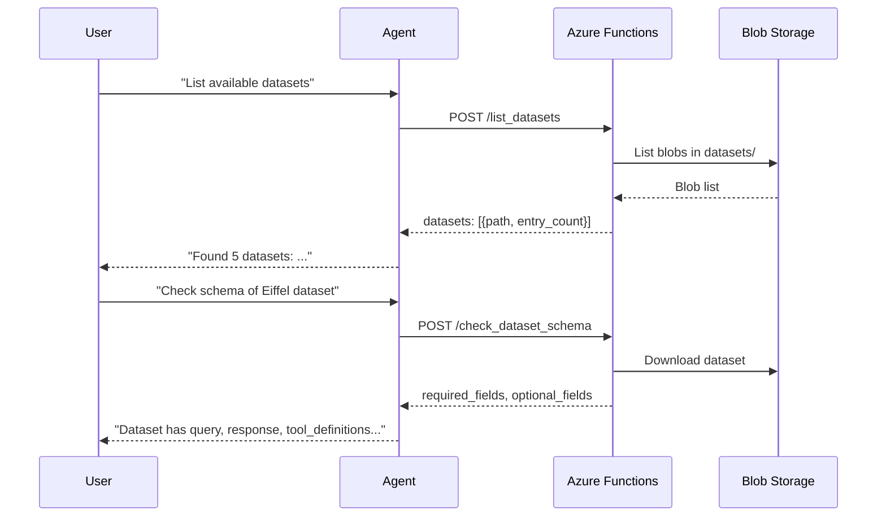

### Workflow 2: Validate Dataset Before Evaluation

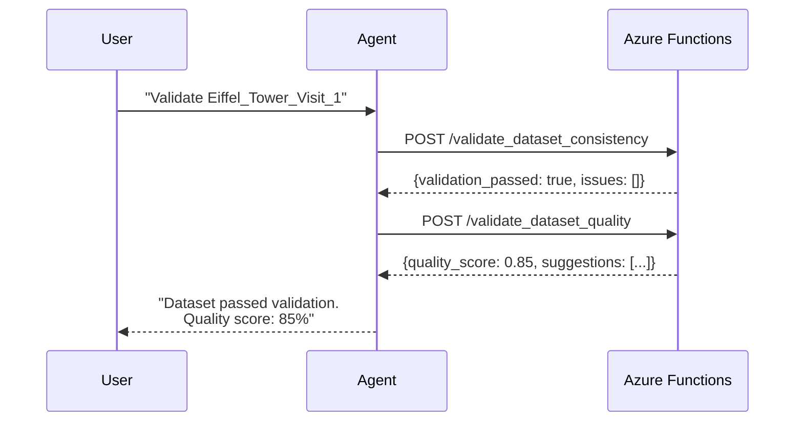

### Workflow 3: Run Evaluation on Existing Dataset

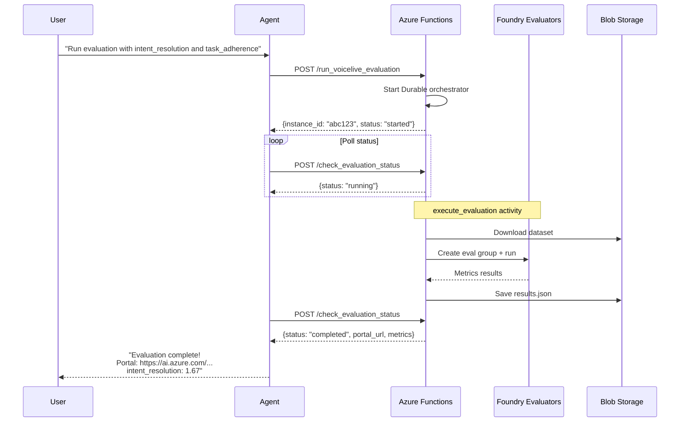

### Workflow 4: Full Audio Processing + Evaluation Pipeline

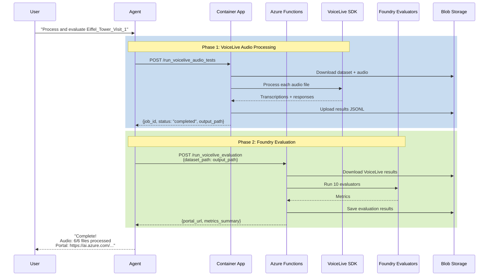

### Workflow 5: Manage Foundry Resources

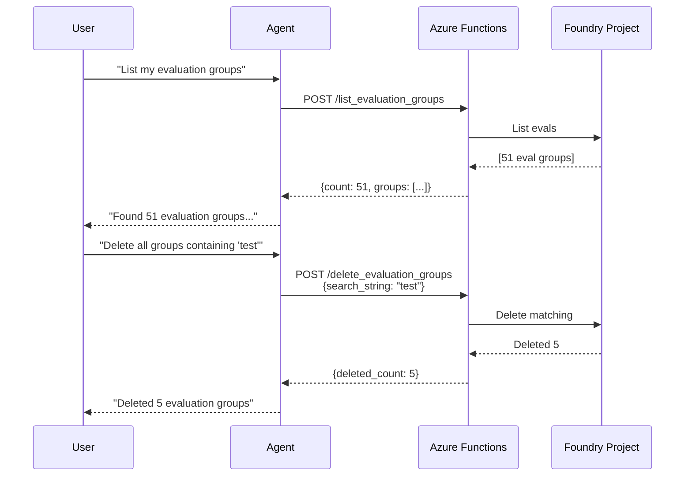

### Workflow 6: Reuse Existing Foundry Resources

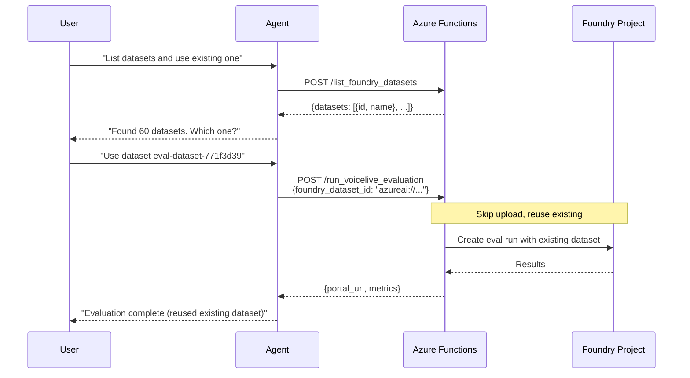

---

## Deployed Resources

| Resource | Name | Purpose |
|----------|------|---------|
| Resource Group | rg-voicelive-eval-v3 | Container for all resources |
| Storage Account | stv3g7ywvldzjeo | datasets/ and outputs/ containers |
| Function App | func-v3g7ywvldzjeo | 14 functions (HTTP + Durable) |
| Container App | ca-voicelive-processor | VoiceLive audio processing |
| Container Registry | acrvoicelive9976 | Container images |
| App Insights | func-v3g7ywvldzjeo-insights | Monitoring |
| **Agent** | voicelive-evaluation-agent-cloud | Foundry Agent |
| **Connection** | voicelive-eval-api-key | Function Key auth |

---

## Open Work Items

### High Priority: Dataset Versioning & Eval Group Strategy

**Goal**: Implement proper versioning and organization for datasets and evaluation groups.

#### Phase 1: Versioning in Function App (Lower Risk, Recommended First)
- [ ] **Version datasets on upload** - Before uploading to Foundry, check if dataset with same base name exists. If so, increment version number.
- [ ] **One eval group per dataset** - Create/reuse eval group named after audio dataset. Add runs to existing group instead of creating new groups each time.
- [ ] **Track lineage metadata** - Store source audio dataset name, processing timestamp, config hash in Foundry dataset description.
- [ ] **Return version info** - Include dataset_id, version, eval_group_id in API responses.

#### Phase 2: Move Upload to Container App (Higher Risk, Future)
- [ ] **Add Foundry SDK to Container App** - Install azure-ai-projects, configure PROJECT_ENDPOINT
- [ ] **Upload to Foundry after processing** - Container App uploads directly to Foundry Data Store after VoiceLive processing completes
- [ ] **Update Function App** - Remove upload logic, use dataset_id provided by Container App
- [ ] **Update agent workflow** - Chain: Container App (returns dataset_id) → Function App (uses dataset_id)

#### Design Decisions
| Decision | Choice | Rationale |
|----------|--------|-----------|
| Dataset naming | Use audio dataset name | Clear lineage, simple |
| Config changes | New version (not new dataset) | Same audio input = same test |
| Eval groups | One per audio dataset | Better organization, easy comparison |
| Fallback | Keep blob upload working | Resilience if Foundry upload fails |

### Other High Priority
- [ ] **Add RBAC assignments to azd automation** - Currently requires manual Azure AI User role assignment
- [ ] **Fix VoiceLive Container App progress tracking** - Shows 0/6 files even when successful
- [ ] **Add webhook notifications** - Notify when long evaluations complete

### Medium Priority
- [ ] **Add Foundry account/project creation to azd** - Currently requires pre-existing Foundry resources
  - Create Cognitive Services account (kind: AIServices) via Bicep
  - Create Foundry project via ARM/Bicep
  - Auto-configure App Insights connection for tracing
  - Create API key connection for Function App auth
- [ ] **Multi-region deployment** - Deploy Functions/Container App closer to data
- [ ] **Add retry logic** - Handle transient failures in VoiceLive SDK
- [ ] **Implement rate limiting** - Prevent quota exhaustion on Foundry evaluators

### Low Priority
- [ ] **Progress streaming** - Report evaluation progress in real-time via SSE
- [ ] **Cost optimization** - Use Premium Functions plan for faster cold starts
- [ ] **Container App scaling** - Auto-scale based on queue depth

### Known Limitations
1. **Metrics sometimes empty** - Foundry SDK may not return metrics immediately after completion
2. **Container App no auth** - Currently public endpoint (add API key or MSI if needed)
3. **eval_group_id reuse** - Only works within same Foundry project
4. **No dataset versioning yet** - Each upload creates new dataset (to be fixed in Phase 1)

### SDK Limitations (Confirmed via Source Review)

The `azure-ai-projects` SDK has the following limitations that require manual configuration:

| Operation | SDK Support | Alternative |
|-----------|-------------|-------------|
| Create Foundry connections | ❌ No | Portal, CLI, Terraform (azapi_resource), ARM |
| Update connection credentials | ❌ No | Portal manual edit |
| Configure agent App Insights | ❌ No | Portal → Tracing → Connect App Insights |
| Delete connections | ❌ No | Portal, Terraform, ARM |

**Connections SDK**: `ConnectionsOperations` only supports `list`, `get`, `get_default` - no create/update/delete methods.

**Workaround for Terraform/IaC**:
```hcl
resource "azapi_resource" "voicelive_connection" {
  type      = "Microsoft.MachineLearningServices/workspaces/connections@2025-01-01-preview"
  name      = "voicelive-eval-api-key"
  parent_id = azurerm_ai_foundry_project.example.id
  body = {
    properties = {
      category = "ApiKey"
      target   = var.function_app_url
      authType = "CustomKeys"
      credentials = { key = var.function_key }
    }
  }
}
```

**Client-side tracing** (calling the agent from your code) is fully supported via `azure-monitor-opentelemetry`:
```python
from azure.monitor.opentelemetry import configure_azure_monitor
configure_azure_monitor(connection_string="InstrumentationKey=...")
```

---

## Version Comparison

| Aspect | v1 | v2 | v3 |
|--------|----|----|-----|
| SDK | azure-ai-agents | azure-ai-agents | **azure-ai-projects** |
| Deployment | Local only | Container Apps | Foundry + Functions + Container App |
| Agent lifecycle | Per-session | Per-session | **Persistent** |
| Audio processing | Local script | Local script | **Cloud Container App** |
| Foundry evaluation | None | None | **10 built-in evaluators** |
| Tracing | Console | AppInsights | **Foundry native** |
| Portal | None | Azure Portal | **AI Foundry Portal** |

---

*Document last updated: February 6, 2026*
