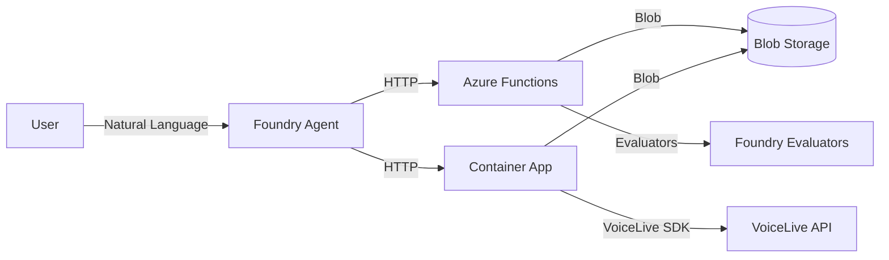

# VoiceLive Evaluation Agent v3

Cloud-native AI agent for automating VoiceLive audio evaluation workflows on Azure AI Foundry.

## Overview

The v3 agent combines:
- **Azure AI Foundry Agent Service** - Natural language orchestration with built-in tracing
- **VoiceLive Container App** - Long-running audio processing through VoiceLive SDK
- **Azure Functions** - Serverless dataset validation and Foundry evaluations
- **Azure Blob Storage** - Dataset and results storage



## Quick Start

### Prerequisites

- Azure subscription with Cognitive Services access
- Azure AI Foundry project
- Azure CLI + azd CLI installed
- Python 3.11+

### Deploy Infrastructure

```bash
cd evaluation_agent_v3

# Login and set subscription
az login
azd auth login

# Deploy Function App + Storage
azd up

# Get deployed resources
FUNC_URL=$(azd env get-value AZURE_FUNCTION_APP_URL)
```

### Deploy Container App (VoiceLive Processing)

```bash
# Build and push container image
cd deploy/container-app
az acr build --registry acrvoicelive9976 --image voicelive-processor:latest .

# Deploy Container App
az containerapp update --name ca-voicelive-processor \
  --resource-group rg-voicelive-eval-v3 \
  --image acrvoicelive9976.azurecr.io/voicelive-processor:latest
```

### Configure Agent

1. **Create Function Key Connection in Foundry Portal**:
   - Go to ai.azure.com → Your Project → Management → Connections
   - Add Custom Keys connection named `voicelive-eval-api-key`
   - Add keys: `code` and `x-functions-key` (same value from Function App)

2. **Create/Update Agent**:
```bash
# Get full connection ID from portal or:
CONNECTION_ID="/subscriptions/<sub>/resourceGroups/<rg>/providers/Microsoft.CognitiveServices/accounts/<account>/projects/<project>/connections/voicelive-eval-api-key"

python setup_agent_openapi.py \
  --function-url $FUNC_URL \
  --connection-name $CONNECTION_ID \
  --update
```

## Usage

### Via Foundry Portal

1. Go to https://ai.azure.com
2. Select your project → Agents → `voicelive-evaluation-agent-cloud`
3. Click **Test** to interact

**Example prompts**:
- "List available datasets"
- "Validate the Eiffel_Tower_Visit_1 dataset"
- "Run evaluation with intent_resolution and task_adherence evaluators"
- "Process audio files from MultiConversationSample through VoiceLive"

### Via Python SDK

```python
from azure.ai.projects import AIProjectClient
from azure.identity import DefaultAzureCredential

client = AIProjectClient(
    endpoint="https://<resource>.services.ai.azure.com/api/projects/<project>",
    credential=DefaultAzureCredential()
)

# Get agent
agent = client.agents.get(name="voicelive-evaluation-agent-cloud")

# Create thread and run
thread = client.agents.threads.create()
client.agents.messages.create(thread_id=thread.id, role="user", 
    content="List available datasets")
run = client.agents.runs.create_and_process(thread_id=thread.id, agent_id=agent.id)

# Get response
messages = client.agents.messages.list(thread_id=thread.id)
print(messages[-1].content[0].text.value)
```

## Available Tools

### Dataset Discovery & Validation

| Tool | Description |
|------|-------------|
| `list_datasets` | List all JSONL datasets in blob storage |
| `check_dataset_schema` | Check required/optional fields |
| `validate_dataset_consistency` | MANDATORY structural validation |
| `validate_dataset_quality` | ADVISORY content quality check |

### VoiceLive Audio Processing (Container App)

| Tool | Description |
|------|-------------|
| `run_voicelive_audio_tests` | Process audio files through VoiceLive SDK |
| `check_voicelive_job_status` | Poll audio processing job status |

### Foundry Evaluation (Azure Functions)

| Tool | Description |
|------|-------------|
| `run_voicelive_evaluation` | Run Foundry evaluators on dataset |
| `check_evaluation_status` | Poll evaluation job status |
| `get_evaluation_recommendations` | Get settings for large datasets |
| `analyze_evaluation_results` | Analyze completed evaluation |

### Foundry Resource Management

| Tool | Description |
|------|-------------|
| `list_evaluation_groups` | List existing eval groups |
| `list_foundry_datasets` | List Foundry-uploaded datasets |
| `delete_evaluation_groups` | Delete eval groups by ID or search |
| `delete_foundry_datasets` | Delete datasets by name or search |

## Default Evaluators

The agent uses 10 evaluators aligned with VoiceLive best practices:

| Evaluator | Model | Purpose |
|-----------|-------|---------|
| intent_resolution | Reasoning | Did agent understand intent? |
| task_adherence | Reasoning | Did agent follow instructions? |
| task_completion | Reasoning | Did agent complete the task? |
| response_completeness | Reasoning | Was response complete? |
| groundedness | Standard | Is response grounded? |
| relevance | Reasoning | Is response relevant? |
| tool_call_accuracy | Reasoning | Were tool calls correct? |
| tool_selection | Reasoning | Did agent pick right tools? |
| tool_input_accuracy | Reasoning | Were tool inputs correct? |
| tool_output_utilization | Reasoning | Did agent use tool outputs? |

Specify custom subset via `evaluators` parameter:
```json
{"evaluators": ["intent_resolution", "task_adherence"]}
```

## Environment Variables

### Function App (deploy/azure-functions/.env)

```env
# Required
PROJECT_ENDPOINT=https://<resource>.services.ai.azure.com/api/projects/<project>
AZURE_STORAGE_CONNECTION_STRING=<connection-string>
AZURE_STORAGE_DATASETS_CONTAINER=datasets
AZURE_STORAGE_OUTPUTS_CONTAINER=outputs

# Evaluator models
AOAI_DEPLOYMENT_NAME=gpt-4.1-mini
AOAI_REASONING_DEPLOYMENT_NAME=o4-mini
```

### Container App (deploy/container-app/.env)

```env
# VoiceLive API
AZURE_VOICELIVE_ENDPOINT=https://<resource>.services.ai.azure.com/
AZURE_VOICELIVE_MODEL=gpt-realtime
AZURE_VOICELIVE_API_VERSION=2025-10-01

# Blob Storage
AZURE_STORAGE_ACCOUNT_URL=https://<account>.blob.core.windows.net
AZURE_STORAGE_DATASETS_CONTAINER=datasets
AZURE_STORAGE_OUTPUTS_CONTAINER=outputs
```

## Dataset Format

Datasets are JSONL files with one entry per line:

```json
{"WavPath": "file1.wav", "Question": "User query", "Answer": "Expected response", "conversationID": "conv1", "system_prompt": "...", "tool_definitions": [...]}
{"WavPath": "file2.wav", "Question": "Another query", "Answer": "Another response", "conversationID": "conv1"}
```

| Field | Required | Description |
|-------|----------|-------------|
| WavPath / audio_path | Yes* | Path to audio file (for raw audio datasets) |
| query / Question | Yes** | User query text |
| response / Answer | Yes** | Agent response text |
| conversationID | No | Group files by conversation |
| system_prompt | No | Agent instructions |
| tool_definitions | No | Available tools for agent |

*Required for VoiceLive audio processing
**Required for Foundry evaluation

## File Structure

```
evaluation_agent_v3/
├── deploy/
│   ├── azure-functions/           # Azure Functions code
│   │   ├── function_app.py        # 14 function endpoints
│   │   ├── openapi.yaml           # OpenAPI spec for agent
│   │   ├── requirements.txt
│   │   └── host.json
│   └── container-app/             # VoiceLive Container App
│       ├── app/
│       │   ├── main.py            # FastAPI endpoints
│       │   ├── processor.py       # Audio processing logic
│       │   ├── voicelive_client.py # VoiceLive SDK client
│       │   └── storage.py         # Blob storage operations
│       ├── Dockerfile
│       └── requirements.txt
├── infra/                         # Bicep infrastructure
├── setup_agent.py                 # Local runner setup
├── setup_agent_openapi.py         # Cloud agent setup
├── runner.py                      # Local tool executor
├── tools.py                       # Tool implementations
├── ARCHITECTURE.md                # Design decisions
└── README.md                      # This file
```

## Deployed Resources

| Resource | Name | URL |
|----------|------|-----|
| Function App | func-v3g7ywvldzjeo | https://func-v3g7ywvldzjeo.azurewebsites.net |
| Container App | ca-voicelive-processor | https://ca-voicelive-processor.ashyisland-d1546750.eastus2.azurecontainerapps.io |
| Storage Account | stv3g7ywvldzjeo | datasets/ + outputs/ containers |
| Agent | voicelive-evaluation-agent-cloud | In Foundry Portal |

## Troubleshooting

### "Blob not found" errors
- Check path format - agent may send various formats
- Verify file exists in correct container (datasets/ vs outputs/)
- Check for `.jsonl` extension

### Evaluation status "failed"
- Check App Insights logs for detailed error
- Verify AOAI_DEPLOYMENT_NAME is valid
- Ensure Azure AI User role assigned to Function's managed identity

### Container App job fails
- Check logs: `az containerapp logs show --name ca-voicelive-processor`
- Verify VoiceLive endpoint and model configured
- Ensure managed identity has Storage Blob Data Contributor

### Agent not finding tools
- Redeploy OpenAPI spec: `python setup_agent_openapi.py --update`
- Verify connection ID is the full resource path
- Check Function App is running and healthy

## See Also

- [ARCHITECTURE.md](ARCHITECTURE.md) - Design decisions and diagrams
- [prototype_v1/](../prototype_v1/) - Original local evaluation scripts
- [Azure AI Foundry Docs](https://learn.microsoft.com/azure/ai-services/agents/)

---

*Last updated: February 6, 2026*
