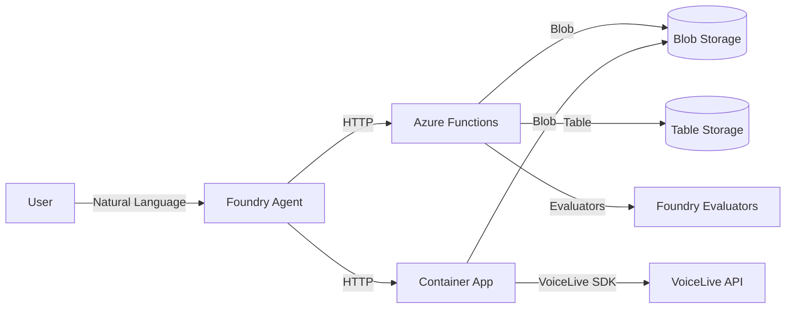

# VoiceLive Evaluation Agent v3

Cloud-native AI agent for automating VoiceLive audio evaluation workflows on Azure AI Foundry.

## Overview

The v3 agent combines:
- **Azure AI Foundry Agent Service** - Natural language orchestration with built-in tracing
- **VoiceLive Container App** - Long-running audio processing through VoiceLive SDK
- **Azure Functions** - Serverless dataset validation and Foundry evaluations
- **Azure Blob Storage** - Dataset and results storage
- **Azure Table Storage** - Session configuration management



## Quick Start

### Prerequisites

- Azure subscription with Cognitive Services access
- Azure CLI + azd CLI installed
- Python 3.11+
- Docker Desktop (for Container App deployment)

### Deploy Infrastructure

Two deployment modes are supported:

#### Option A: Create New Foundry Project (Default)

```bash
cd evaluation_agent_v3

# Login
az login
azd auth login

# Create environment — Foundry account + project created automatically
azd env new my-voicelive-eval --location eastus2
azd env set DEPLOY_CONTAINER_APP true

# Deploy everything (Foundry + Functions + Container App + Storage)
azd up
```

This creates an AI Services account, Foundry project, model deployments (gpt-4.1-mini, o4-mini), and all infrastructure. Post-provision hooks automatically seed session configs, assign RBAC, and create the Foundry connection.

#### Option B: Use Existing Foundry Project

```bash
cd evaluation_agent_v3

az login
azd auth login

azd env new my-voicelive-eval --location eastus2
azd env set CREATE_FOUNDRY false
azd env set PROJECT_ENDPOINT "https://<resource>.services.ai.azure.com/api/projects/<project>"
azd env set AZURE_VOICE_LIVE_ENDPOINT "https://<resource>.services.ai.azure.com/"
azd env set FOUNDRY_ACCOUNT_RESOURCE_ID "/subscriptions/<sub>/resourceGroups/<rg>/providers/Microsoft.CognitiveServices/accounts/<account>"
azd env set DEPLOY_CONTAINER_APP true

azd up
```

### Session Configurations (Auto-Seeded)

Session configs are automatically seeded by the post-provision hook. To re-seed manually:

```bash
./scripts/azd/seed-session-configs.ps1 -StorageAccountName <storage-account-name>
```

### Create Foundry Agent

```bash
# Get function URL from azd output
FUNC_URL=$(azd env get-value AZURE_FUNCTION_APP_URL)

# Create agent with OpenAPI tools
python setup_agent_openapi.py --function-url $FUNC_URL

# Or update existing agent
python setup_agent_openapi.py --function-url $FUNC_URL --update
```

> **Note**: VoiceLive audio processing endpoints are proxied through the Function App,
> so you only need the Function URL. The agent doesn't need separate Container App access.

### Configure Agent Authentication (Production)

1. **Create Function Key Connection in Foundry Portal**:
   - Go to ai.azure.com → Your Project → Management → Connections
   - Add Custom Keys connection named `voicelive-eval-api-key`
   - Add keys: `code` and `x-functions-key` (same value from Function App)

2. **Update Agent with Connection**:
```bash
CONNECTION_ID="/subscriptions/<sub>/resourceGroups/<rg>/providers/Microsoft.CognitiveServices/accounts/<account>/projects/<project>/connections/voicelive-eval-api-key"

python setup_agent_openapi.py \
  --function-url $FUNC_URL \
  --connection-name $CONNECTION_ID \
  --update
```

### Enable Agent Tracing (RBAC)

For agent tracing to work in Application Insights, the Foundry project's managed identity needs the Azure AI User role:

```powershell
# Option 1: Via azd environment (if Foundry account in same RG)
azd env set FOUNDRY_PROJECT_PRINCIPAL_ID "<project-managed-identity-object-id>"
azd env set FOUNDRY_ACCOUNT_NAME "<cognitive-services-account-name>"
azd up

# Option 2: Cross-resource-group (most common)
./scripts/azd/configure-foundry-rbac.ps1 `
  -FoundryAccountResourceId "/subscriptions/<sub>/resourceGroups/<rg>/providers/Microsoft.CognitiveServices/accounts/<account>" `
  -FoundryProjectPrincipalId "<project-managed-identity-object-id>"
```

**Finding the Principal ID**: Foundry Portal → Project Settings → Identity → Object (Principal) ID

**Note**: Recently granted permissions may take several minutes to propagate.

### Function App RBAC (for Foundry Access)

The Function App needs access to Foundry for listing evaluation groups and running evaluations. This is **automated** by the post-provision hook when `FOUNDRY_ACCOUNT_RESOURCE_ID` is set:

```powershell
# Set before azd up to enable automated RBAC
azd env set FOUNDRY_ACCOUNT_RESOURCE_ID "/subscriptions/<sub>/resourceGroups/<rg>/providers/Microsoft.CognitiveServices/accounts/<account>"
```

Or assign manually:

```powershell
# Get Function App managed identity principal ID
$principalId = az functionapp identity show --name <func-name> --resource-group <rg> --query principalId -o tsv

# Assign Azure AI Developer role (required for evaluations data actions)
az role assignment create `
  --assignee-object-id $principalId `
  --assignee-principal-type ServicePrincipal `
  --role "Azure AI Developer" `
  --scope "/subscriptions/<sub>/resourceGroups/<rg>/providers/Microsoft.CognitiveServices/accounts/<account>"
```

**Required roles for full functionality**:
- **Azure AI Developer** - For evaluations read/write (data plane actions)
- **Cognitive Services User** - For general Cognitive Services access

### Post-Provision Automation

The `scripts/azd/postprovision.ps1` hook runs after `azd provision` and handles:

1. **Seed session configs** - Populates Azure Table Storage with 7 default VoiceLive configurations
2. **Set Container App URL** - Configures the Function App with the Container App endpoint
3. **Assign Function App RBAC** - Grants Azure AI Developer + Cognitive Services User to Function App MI
4. **Assign Container App RBAC** - Grants Cognitive Services User + Storage Blob/Table Contributor to Container App MI
5. **Create Foundry connection** - Creates CustomKeys connection with Function App key (requires `PROJECT_ENDPOINT` + `FOUNDRY_ACCOUNT_RESOURCE_ID`)

## Usage

### Via Foundry Portal

1. Go to https://ai.azure.com
2. Select your project → Agents → `voicelive-evaluation-agent-cloud`
3. Click **Test** to interact

**Example prompts**:
- "List available datasets"
- "Validate the Eiffel_Tower_Visit_1 dataset"
- "Run evaluation with intent_resolution and task_adherence evaluators"
- "Process audio files from MultiConversationSample through VoiceLive"

### Via Python SDK

```python
from azure.ai.projects import AIProjectClient
from azure.identity import DefaultAzureCredential

# SDK 2.0+ pattern with context managers
with (
    DefaultAzureCredential() as credential,
    AIProjectClient(
        endpoint="https://<resource>.services.ai.azure.com/api/projects/<project>",
        credential=credential
    ) as client,
    client.get_openai_client() as openai_client,
):
    # Use Responses API with agent reference
    response = openai_client.responses.create(
        input=[{"role": "user", "content": "List available datasets"}],
        extra_body={"agent": {"name": "voicelive-evaluation-agent-cloud", "type": "agent_reference"}},
    )
    print(response.output_text)
```

### Testing the Agent

Run the included test script to verify all agent capabilities:

```bash
# Test a single capability
python test_agent_cloud.py --test list_datasets

# Run all tests
python test_agent_cloud.py --test all

# List available tests
python test_agent_cloud.py --list-tests
```

**Available tests**: `list_datasets`, `list_evaluators`, `list_session_configs`, `check_dataset_schema`, `validate_dataset`, `list_evaluation_groups`, `streaming`

## Available Tools

### Session Configuration Management

| Tool | Description |
|------|-------------|
| `list_session_configs` | List all VoiceLive session configurations |
| `get_session_config` | Get details of a specific config |
| `create_session_config` | Create new VoiceLive config |
| `update_session_config` | Update existing config |
| `delete_session_config` | Delete a config |

### Dataset Discovery & Validation

| Tool | Description |
|------|-------------|
| `list_datasets` | List datasets from both stores (voicelive/evaluation/all) |
| `check_dataset_schema` | Detect dataset type and list fields (supports blob paths, Foundry names, `azureai://` URIs) |
| `validate_voicelive_dataset` | Validate VoiceLive audio dataset (WavPath required) |
| `validate_eval_dataset` | Validate evaluation-ready dataset (supports blob paths, Foundry names, `azureai://` URIs) |
| `validate_dataset_consistency` | Backward-compat alias for validate_voicelive_dataset |
| `validate_dataset_quality` | ADVISORY content quality check |

### Dataset Upload

| Tool | Description |
|------|-------------|
| `get_upload_url` | Get SAS URL for uploading a new dataset |
| `finalize_upload` | Validate and route uploaded dataset to correct store |

### VoiceLive Audio Processing (Container App)

| Tool | Description |
|------|-------------|
| `run_voicelive_audio_tests` | Process audio files through VoiceLive SDK |
| `check_voicelive_job_status` | Check audio processing job status (auto-registers output as Foundry dataset) |

> **Note:** The agent cannot autonomously poll for status updates. When checking job or evaluation status, ask the agent explicitly — it will not loop or track status on its own.

### Foundry Evaluation (Azure Functions)

| Tool | Description |
|------|-------------|
| `run_voicelive_evaluation` | Run Foundry evaluators on dataset |
| `check_evaluation_status` | Poll evaluation job status |
| `get_evaluation_recommendations` | Get settings for large datasets |
| `analyze_evaluation_results` | Analyze completed evaluation |

### Foundry Resource Management

| Tool | Description |
|------|-------------|
| `list_evaluation_groups` | List existing eval groups |
| `list_foundry_datasets` | List Foundry-uploaded datasets |
| `delete_evaluation_groups` | Delete eval groups by ID or search |
| `delete_foundry_datasets` | Delete datasets by name or search |

## Default Evaluators

The agent uses 10 evaluators aligned with VoiceLive best practices:

| Evaluator | Model | Purpose |
|-----------|-------|---------|
| intent_resolution | Reasoning | Did agent understand intent? |
| task_adherence | Reasoning | Did agent follow instructions? |
| task_completion | Reasoning | Did agent complete the task? |
| response_completeness | Reasoning | Was response complete? |
| groundedness | Standard | Is response grounded? |
| relevance | Reasoning | Is response relevant? |
| tool_call_accuracy | Reasoning | Were tool calls correct? |
| tool_selection | Reasoning | Did agent pick right tools? |
| tool_input_accuracy | Reasoning | Were tool inputs correct? |
| tool_output_utilization | Reasoning | Did agent use tool outputs? |

Specify custom subset via `evaluators` parameter:
```json
{"evaluators": ["intent_resolution", "task_adherence"]}
```

## Environment Variables

### Function App (deploy/azure-functions/.env)

```env
# Required
PROJECT_ENDPOINT=https://<resource>.services.ai.azure.com/api/projects/<project>
AZURE_STORAGE_CONNECTION_STRING=<connection-string>
AZURE_STORAGE_DATASETS_CONTAINER=datasets
AZURE_STORAGE_OUTPUTS_CONTAINER=outputs

# Evaluator models
AOAI_DEPLOYMENT_NAME=gpt-4.1-mini
AOAI_REASONING_DEPLOYMENT_NAME=o4-mini
```

### Container App (deploy/container-app/.env)

```env
# VoiceLive API
AZURE_VOICELIVE_ENDPOINT=https://<resource>.services.ai.azure.com/
AZURE_VOICELIVE_MODEL=gpt-realtime
AZURE_VOICELIVE_API_VERSION=2025-10-01

# Blob Storage
AZURE_STORAGE_ACCOUNT_URL=https://<account>.blob.core.windows.net
AZURE_STORAGE_DATASETS_CONTAINER=datasets
AZURE_STORAGE_OUTPUTS_CONTAINER=outputs
```

## Dataset Format

There are two distinct dataset types with different stores and schemas:

### VoiceLive Audio Datasets (Blob Storage)

Stored in blob `datasets/` container. Contains audio files for VoiceLive processing.

```json
{"WavPath": "file1.wav", "Question": "User query", "Answer": "Expected response", "conversationID": "conv1", "system_prompt": "..."}
{"WavPath": "file2.wav", "Question": "Another query", "Answer": "Another response", "conversationID": "conv1"}
```

| Field | Required | Description |
|-------|----------|-------------|
| WavPath / audio | **Yes** | Path to audio file |
| Question | No | User query text |
| Answer | No | Expected response text |
| conversationID | No | Group files by conversation |
| system_prompt | No | Agent instructions |
| tool_definitions | No | Available tools for agent |

### Evaluation-Ready Datasets (Foundry Data Store)

Stored in Foundry Data Store (versioned). Ready for direct Foundry evaluation.

```json
{"query": "What is the Eiffel Tower?", "response": "The Eiffel Tower is...", "context": "Travel guide", "ground_truth": "Iron lattice tower in Paris"}
{"query": "Book a hotel", "response": "I found 3 hotels...", "tool_calls": [...]}
```

| Field | Required | Description |
|-------|----------|-------------|
| query | **Yes** | User query text |
| response | **Yes** | Agent response text |
| ground_truth | No | Expected ideal answer |
| context | No | Additional context for grounding |
| tool_calls | No | Tool calls made by agent |
| tool_definitions | No | Available tools |

### Upload Workflow

1. `get_upload_url(name, type)` → receive SAS URL
2. Upload file to SAS URL (`.zip` for VoiceLive, `.jsonl` for evaluation)
3. `finalize_upload(upload_id, name, type)` → validates and routes:
   - **VoiceLive**: extracts zip to blob `datasets/{name}/`
   - **Evaluation**: validates fields, uploads to Foundry Data Store (auto-versioned)

## File Structure

```
evaluation_agent_v3/
├── deploy/
│   ├── azure-functions/           # Azure Functions code
│   │   ├── function_app.py        # 23 function endpoints
│   │   ├── openapi.yaml           # OpenAPI spec for agent
│   │   ├── requirements.txt
│   │   └── host.json
│   └── container-app/             # VoiceLive Container App
│       ├── app/
│       │   ├── main.py            # FastAPI endpoints
│       │   ├── processor.py       # Audio processing logic
│       │   ├── voicelive_client.py # VoiceLive SDK client
│       │   └── storage.py         # Blob storage operations
│       ├── Dockerfile
│       └── requirements.txt
├── infra/                         # Bicep infrastructure
│   ├── main.bicep                 # Main deployment template
│   ├── main.parameters.json       # Parameters with defaults
│   └── modules/                   # Reusable modules
│       ├── foundry.bicep          # AI Services + Project + Models
│       ├── storage.bicep          # Storage + Tables
│       ├── function-app.bicep     # Functions + App Insights
│       └── container-app.bicep    # Container App + ACR + EasyAuth
├── scripts/
│   └── azd/                       # Deployment scripts
│       ├── seed-session-configs.ps1  # Seed default configs
│       ├── deploy-container-app.ps1  # Build & deploy container
│       ├── postprovision.ps1         # RBAC, connections, app roles
│       ├── postdeploy.ps1            # Agent setup after deploy
│       └── setup-agent.ps1           # Create/update Foundry agent
├── setup_agent.py                 # Local runner setup
├── setup_agent_openapi.py         # Cloud agent setup (OpenAPI)
├── runner.py                      # Local tool executor
├── tools.py                       # Tool implementations
├── test_agent_cloud.py            # Cloud E2E tests (9 tests)
├── test_agent_behavior.py         # Behavioral routing tests (6 tests)
├── test_agent_sdk.py              # SDK integration tests
├── azure.yaml                     # azd configuration
├── ARCHITECTURE.md                # Design decisions & flowcharts
└── README.md                      # This file
```

## Testing

### Integration Tests

Run the integration tests to verify all endpoints:

```bash
# Set function key (get from Azure Portal or CLI)
export AZURE_FUNCTION_KEY=$(az functionapp keys list --name <func-name> --resource-group <rg> --query "functionKeys.default" -o tsv)

# Run tests
python test_agent_sdk.py --function-url https://<func-name>.azurewebsites.net/api
```

Expected output:
```
============================================================
VoiceLive Evaluation Agent v3 - Integration Tests
============================================================
[1/10] list_session_configs
   ✓ Found 7 configs
[2/10] get_session_config
   ✓ Got config: default (Model: gpt-4.1)
...
Total: 10/10 tests passed
```

## Session Configurations

The agent supports 7 pre-configured VoiceLive settings:

| Config | Model | Sample Rate | VAD Type | EOU |
|--------|-------|-------------|----------|-----|
| default | gpt-4.1 | 24000 | azure_semantic_vad_multilingual | ✓ |
| conf1 | gpt-realtime | 16000 | server_vad | ✗ |
| conf2 | gpt-realtime-mini | 16000 | server_vad | ✗ |
| conf3 | gpt-4.1 | 16000 | server_vad | ✓ |
| conf4 | gpt-realtime | 24000 | azure_semantic_vad_multilingual | ✗ |
| conf5 | gpt-realtime-mini | 24000 | azure_semantic_vad_multilingual | ✗ |
| conf6 | gpt-4.1 | 24000 | azure_semantic_vad_multilingual | ✓ |

Create custom configurations via the agent:
```
"Create a new session config named 'low-latency' with model gpt-realtime-mini, sample_rate 16000, and vad_type server_vad"
```

## Deployed Resources

After `azd up`, the following resources are created:

| Resource | Purpose |
|----------|---------|
| Resource Group | `rg-<env-name>` |
| AI Services Account | `ai-<token>` - Foundry account (if CREATE_FOUNDRY=true) |
| Foundry Project | `<env-name>` - AI project with model deployments |
| Storage Account | `st<token>` - datasets/, outputs/, tables |
| Function App | `func-<token>` - 23 HTTP endpoints |
| Container App | `ca-voicelive-<token>` - VoiceLive processor |
| Container Registry | `acr<token>` - Docker images |
| App Insights | `func-<token>-insights` - Telemetry |
| Table: sessionconfigs | VoiceLive session configurations |
| Table: configjournal | Evaluation group → config mapping |

## Troubleshooting

### "Blob not found" errors
- Check path format - agent may send various formats
- Verify file exists in correct container (datasets/ vs outputs/)
- Check for `.jsonl` extension

### Evaluation status "failed"
- Check App Insights logs for detailed error
- Verify AOAI_DEPLOYMENT_NAME is valid
- Ensure Azure AI User role assigned to Function's managed identity

### Container App job fails
- Check logs: `az containerapp logs show --name ca-voicelive-processor`
- Verify VoiceLive endpoint and model configured
- Ensure managed identity has Storage Blob Data Contributor

### Agent not finding tools
- Redeploy OpenAPI spec: `python setup_agent_openapi.py --update`
- Verify connection ID is the full resource path
- Check Function App is running and healthy

### Agent tool calls return 401
- The Foundry connection has an old/invalid function key
- Get the current function key: `az functionapp keys list --name <func-name> --resource-group <rg> --query "functionKeys.default" -o tsv`
- Update the connection in Foundry Portal → Management → Connections → Edit

### azd deploy gets stuck on Container App
- Known issue: `azd deploy` may hang pushing the Container App image to ACR
- Workaround: deploy Container App manually:
```bash
cd deploy/container-app
docker build -t <acr>.azurecr.io/voicelive-processor:latest .
az acr login --name <acr>
docker push <acr>.azurecr.io/voicelive-processor:latest
az containerapp update --name <ca-name> --resource-group <rg> --image <acr>.azurecr.io/voicelive-processor:latest
```

### Cognitive Services account recreation fails
- Deleting an AI Services account soft-deletes it; recreating with the same name in the same region fails
- Purge the soft-deleted account first: `az cognitiveservices account purge --name <name> --resource-group <rg> --location <location>`

## SDK Limitations

The following operations require **manual configuration** in the Foundry Portal or via Terraform/ARM - they cannot be done via the Python SDK:

| Operation | SDK Support | Alternative |
|-----------|-------------|-------------|
| Create/update connections | ❌ No | Foundry Portal, Terraform (azapi_resource), ARM |
| Configure agent App Insights | ❌ No | Foundry Portal → Tracing → Connect App Insights |
| Delete connections | ❌ No | Foundry Portal, Terraform, ARM |

**Client-side tracing** (your code calling the agent) is fully supported via SDK:
```python
from azure.monitor.opentelemetry import configure_azure_monitor
configure_azure_monitor(connection_string="InstrumentationKey=...")
```

For **agent-side tracing** (traces appearing in Foundry portal):
1. Go to ai.azure.com → Your Project → Tracing
2. Click "Connect Application Insights"
3. Select or create App Insights resource
4. This is a one-time setup per project

## See Also

- [ARCHITECTURE.md](ARCHITECTURE.md) - Design decisions and diagrams
- [prototype_v1/](../prototype_v1/) - Original local evaluation scripts
- [Azure AI Foundry Docs](https://learn.microsoft.com/azure/ai-services/agents/)

---

*Last updated: February 16, 2026*
