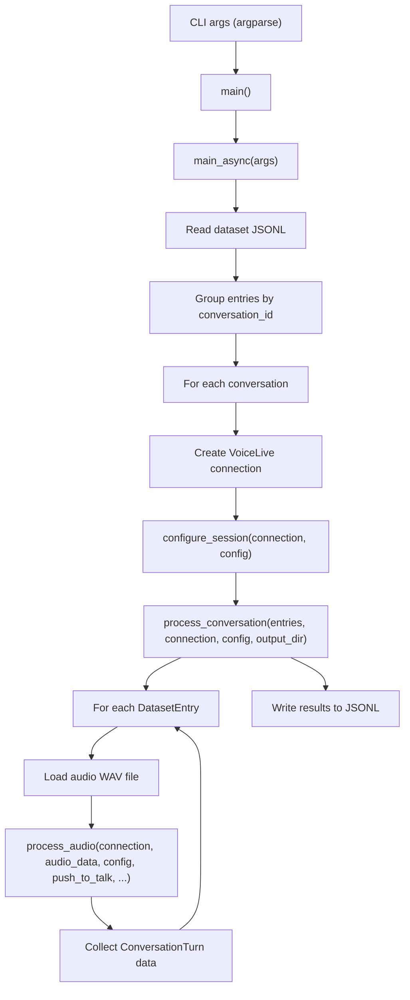
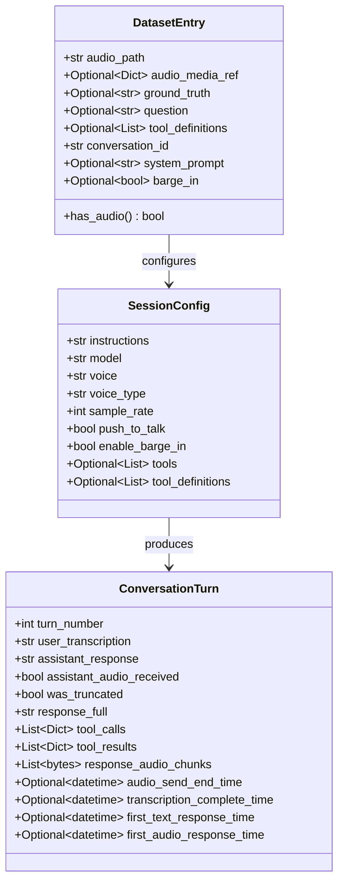
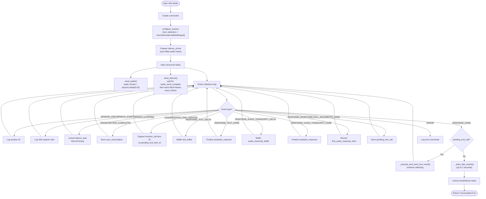
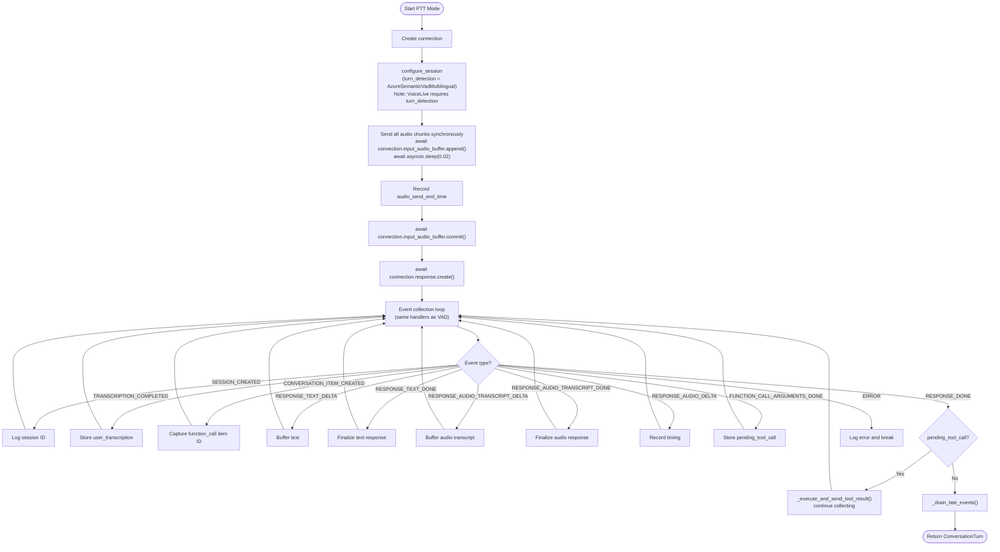
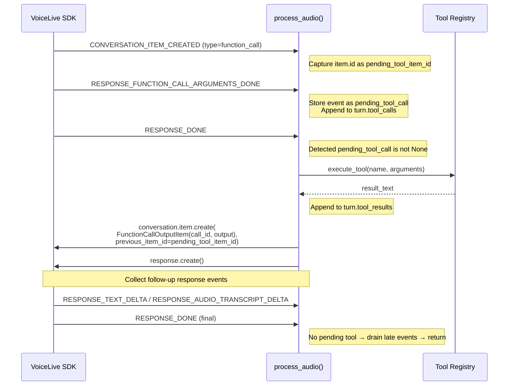
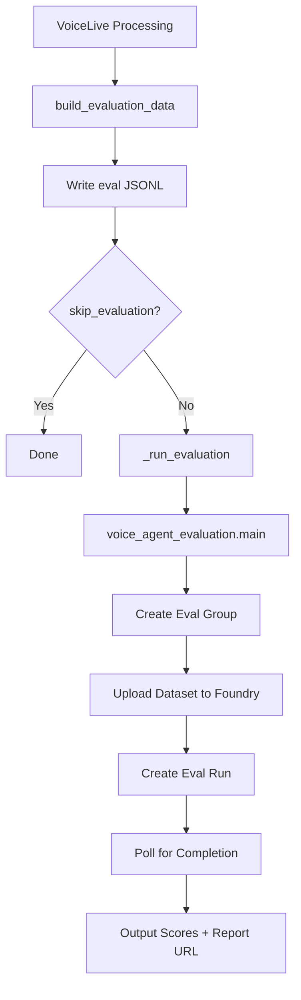
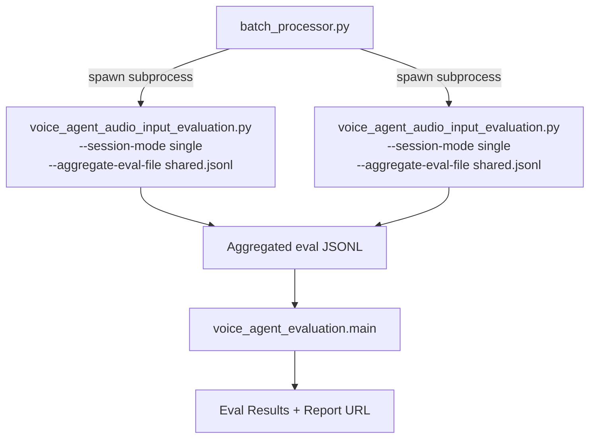

# Voice Agent Audio Input Evaluation — Architecture

*Last updated: February 19, 2026*

## Overview

Single-file CLI tool that processes pre-recorded audio through Azure VoiceLive SDK for evaluation.
Pure async Python — no threading, no legacy wrappers.
Aligned with the cloud container-app implementation in `evaluation_agent/deploy/container-app/`.

## Component Architecture

## Data Model

## VAD Mode Processing Flow

## PTT Mode Processing Flow

## Tool Call Handling Flow

## Event Handling

| Event | Handler | Purpose |
|-------|---------|---------|
| `SESSION_CREATED` | Log session ID | Connection confirmation |
| `INPUT_AUDIO_BUFFER_SPEECH_STARTED` | Log | VAD detected speech |
| `INPUT_AUDIO_BUFFER_SPEECH_STOPPED` | Cancel silence task, record timing | VAD detected end of speech |
| `CONVERSATION_ITEM_INPUT_AUDIO_TRANSCRIPTION_COMPLETED` | Store `user_transcription` | Speech-to-text done |
| `CONVERSATION_ITEM_CREATED` | Capture function_call item ID | Tool call detection |
| `RESPONSE_TEXT_DELTA` | Buffer `text_buffer` | Streaming text response |
| `RESPONSE_TEXT_DONE` | Finalize `assistant_response` | Text complete |
| `RESPONSE_AUDIO_TRANSCRIPT_DELTA` | Buffer `audio_transcript_buffer` | Streaming audio transcript |
| `RESPONSE_AUDIO_TRANSCRIPT_DONE` | Finalize `assistant_response` | Audio transcript complete |
| `RESPONSE_AUDIO_DELTA` | Collect audio bytes in `response_audio_chunks` | Response audio data |
| `RESPONSE_FUNCTION_CALL_ARGUMENTS_DONE` | Store `pending_tool_call` | Tool arguments ready |
| `RESPONSE_DONE` | Execute tool or drain late events, break | Turn complete |
| `CONVERSATION_ITEM_TRUNCATED` | Set `was_truncated`, save `response_full`, slice response | Barge-in truncation |
| `ERROR` | Log and break | Error handling |

## Late Event Drain

After `RESPONSE_DONE`, `_drain_late_events()` waits up to 2 seconds for late-arriving events:

- Transcription events that arrive after response completion
- Additional text/audio transcript deltas
- Uses longest response (max of text vs audio transcript) to avoid truncation

## Design Decisions

### 1. Pure Async (No Threading)

Old prototype used threading (background event loop + main thread orchestration).
New: pure `async`/`await` — simpler, fewer race conditions.

### 2. VAD Always Required

VoiceLive SDK requires `turn_detection` to be set. Setting `None` breaks sessions.
PTT mode keeps VAD configured but adds `commit()` + `response.create()`.

### 3. Tool Execution After RESPONSE_DONE

Official SDK sample pattern. Executing during response stream causes issues.
Wait for `RESPONSE_DONE` → execute → send result → request follow-up.

### 4. Silence Keepalive (VAD Only)

After audio send completes, `send_silence()` sends zero-filled frames every 100ms to keep VAD active.
Without this, VAD may time out before response is complete.
PTT doesn't need this since it uses explicit `commit()`/`create()`.

### 5. Single-File Architecture

Unlike the container-app (split into client/processor/config/storage/jobs),
the prototype keeps everything in one file for ease of use and portability.

## Known Platform Limitations

1. `turn_detection=None` not supported — breaks sessions entirely
2. PTT achieves ~50-60% response rate vs VAD ~90-100% due to `conversation_already_has_active_response` race condition
3. No official SDK sample for PTT or pre-recorded audio processing
4. Tool definitions as single dict silently ignored — normalize to list
5. `RESPONSE_AUDIO_DELTA` may not deliver complete response audio — saved WAVs can be smaller than real-time playback
6. Evaluations API not available in all regions (e.g. `southcentralus`) — use Sweden Central or East US 2

## Evaluation Pipeline Integration

After VoiceLive processing, the script optionally runs Azure AI Foundry evaluation:

### Evaluation Data Format

The `build_evaluation_data()` function constructs `query` as a **conversation history list** (not a plain string), matching the format expected by Azure AI Foundry agent evaluators:

- **Turn 1**: `[system_msg, user_msg]`
- **Turn 2**: `[system_msg, user_msg_1, assistant_msg_1, user_msg_2]`
- **Turn 3 (with tools)**: `[system_msg, user_msg_1, assistant_msg_1, user_msg_2, assistant_tool_calls_msg, tool_result_msg, assistant_msg_2, user_msg_3]`

This ensures evaluators like `intent_resolution` and `task_adherence` have full conversation context for accurate scoring.

### Conversation History Tracking

After each turn, the assistant's response (including tool call announcements) and tool results are stored in `conversation_history`. This list is prepended to subsequent turns' `query` messages so the evaluator sees the full multi-turn context.

### Batch Processor Architecture

Each subprocess writes to a shared `--aggregate-eval-file` and skips per-subprocess evaluation. After all subprocesses complete, the batch processor runs a single final evaluation on the aggregated JSONL.

## Comparison with Container App

| Aspect | Prototype | Container App |
|--------|-----------|---------------|
| Architecture | Single file CLI | FastAPI service (4+ modules) |
| Storage | Local filesystem | Azure Blob Storage |
| Job management | None (batch_processor for parallelism) | Async job queue |
| Concurrency | Sequential conversations (batch_processor for parallel) | Configurable workers |
| Audio source | Local WAV files | Blob-downloaded WAV |
| Dataset source | Local JSONL or `--foundry-dataset` | Blob path or `foundry_dataset` (direct Foundry download) |
| Media format | `input_audio` via base64 data-URI / blob URL | Same |
| Output | Local JSONL + WAV + operational summary | Blob-uploaded JSONL |
| Evaluation | Integrated (voice_agent_evaluation.py) | Not integrated (separate step) |
| Core patterns | Identical | Identical |
| SDK integration | Identical | Identical |
| PTT/VAD | Identical | Identical |
| Tool handling | Identical | Identical |
